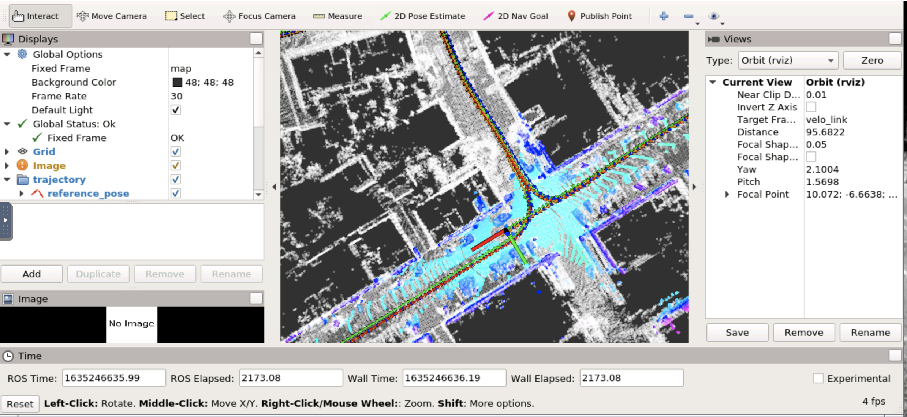
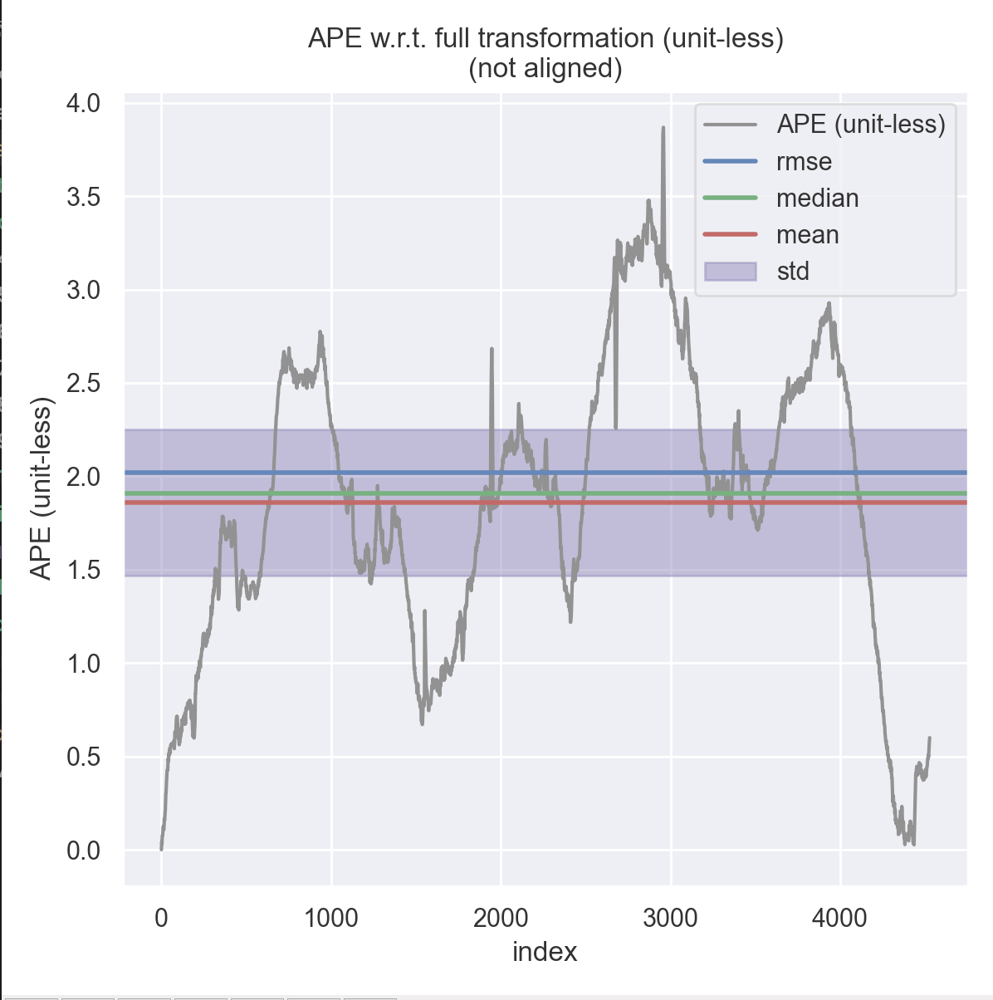
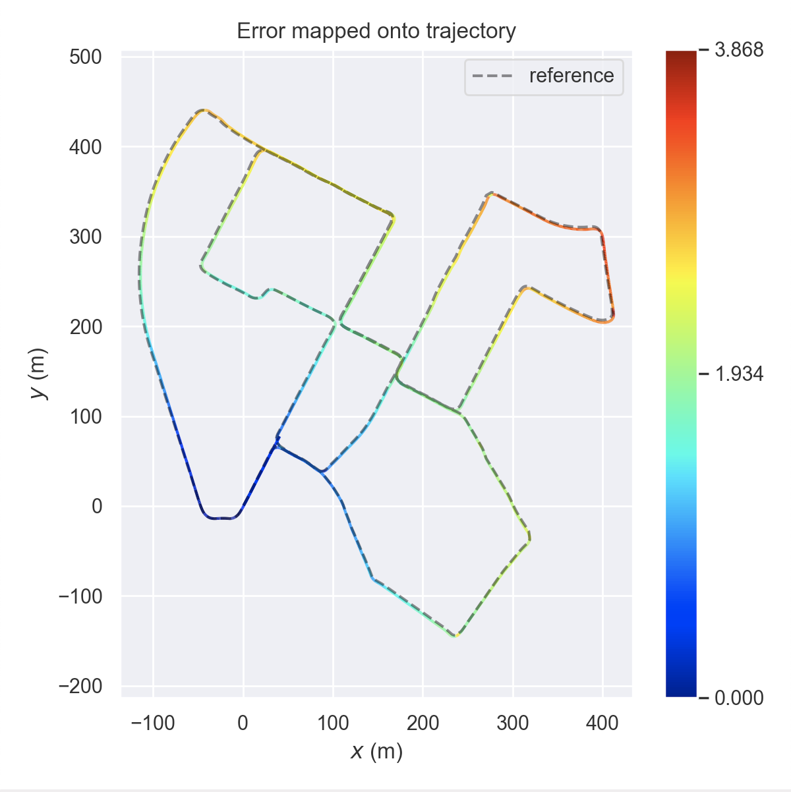
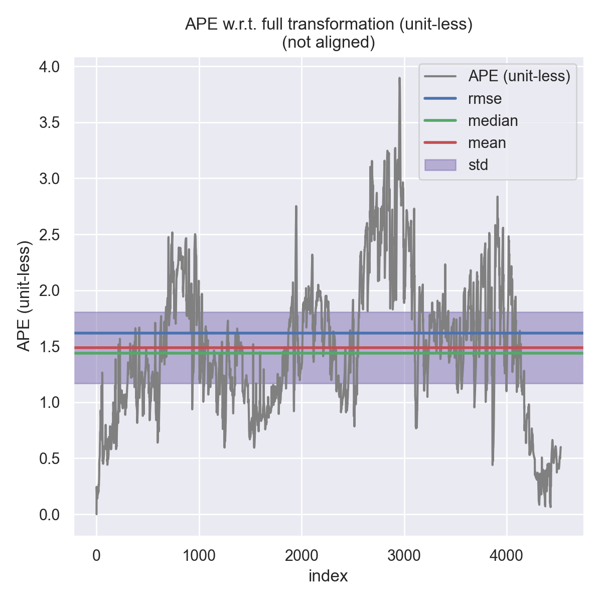
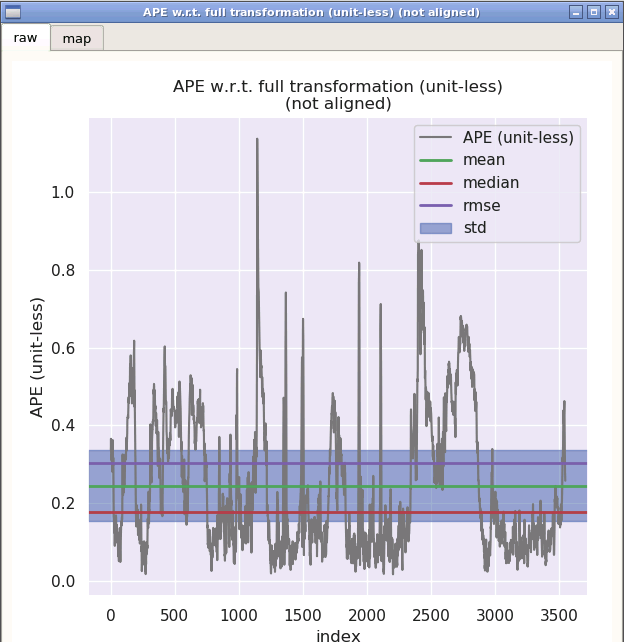
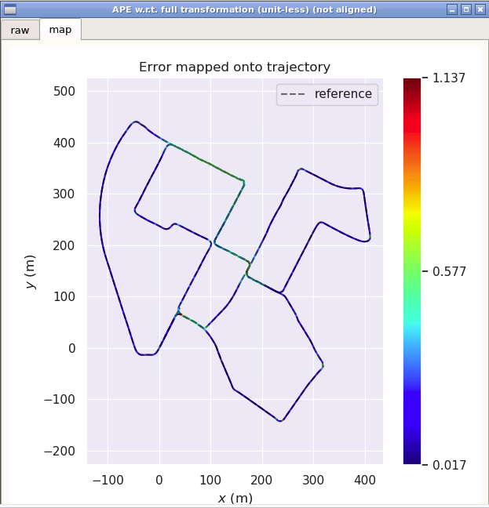
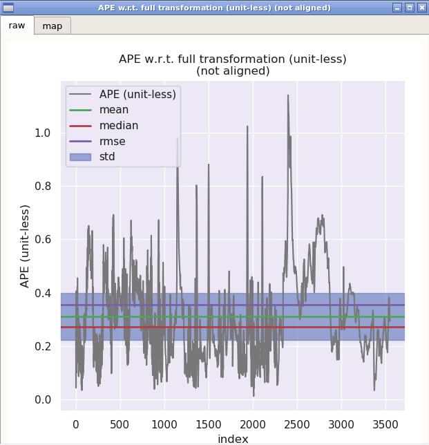
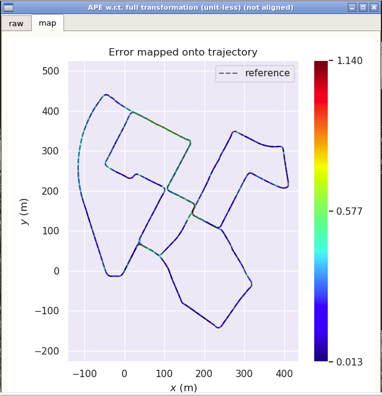
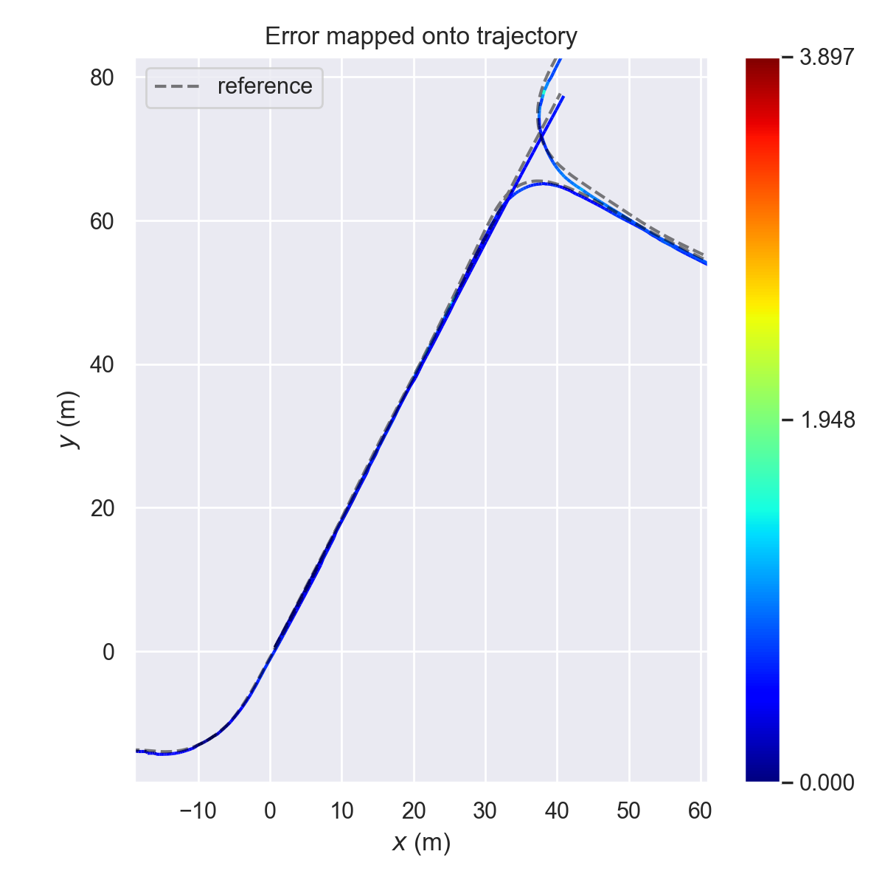
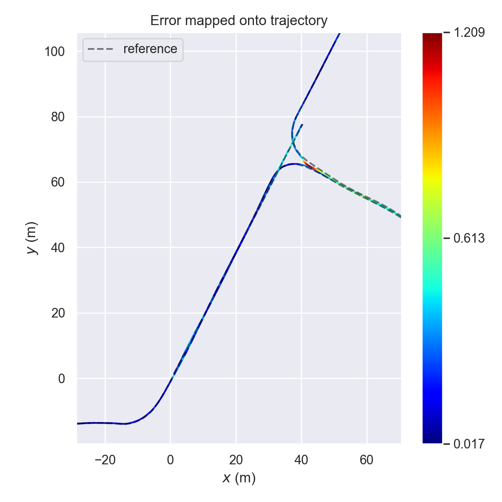

<!--
 * @Author your name
 * @Date 2021-10-26 11:25:12
 * @LastEditTime 2021-10-31 05:40:21
 * @LastEditors Please set LastEditors
 * @Description In User Settings Edit
 * @FilePath /10-sliding-window/Users/zhiweichen/workspace/sensor-fusion-for-localization-and-mapping/workspace/doc/L10_hw/README.md
-->
# Sensor Fusion for Localization and Mapping Lecture10 Homework

## 1. 实现**基于图优化的定位方法**，补全代码框架  
代码修改如下 
### 滑窗更新
```c++
bool SlidingWindow::Update(void) {
    static KeyFrame last_key_frame_ = current_key_frame_;

    //
    // add node for new key frame pose:
    //
    // fix the pose of the first key frame for lidar only mapping:
    if ( sliding_window_ptr_->GetNumParamBlocks() == 0 ) {
        // TODO!: add init key frame
        // 第一帧
        sliding_window_ptr_->AddPRVAGParam(current_key_frame_, true);
    } else {
        // TODO!: add current key frame
        sliding_window_ptr_->AddPRVAGParam(current_key_frame_, false);
    }

    // get num. of vertices:
    const int N = sliding_window_ptr_->GetNumParamBlocks();
    // get param block ID, current:
    const int param_index_j = N - 1;

    //
    // add unary constraints:
    //
    //
    // a. map matching / GNSS position:
    //
    if ( N > 0 && measurement_config_.source.map_matching ) {
        // get prior position measurement:
        Eigen::Matrix4d prior_pose = current_map_matching_pose_.pose.cast<double>();

        // TODO!: add constraint, GNSS position:
        sliding_window_ptr_->AddPRVAGMapMatchingPoseFactor(param_index_j, prior_pose, measurement_config_.noise.map_matching);
    }

    //
    // add binary constraints:
    //
    if ( N > 1 ) {
        // get param block ID, previous:
        const int param_index_i = N - 2;
        
        //
        // a. lidar frontend:
        //
        // get relative pose measurement:
        Eigen::Matrix4d relative_pose = (last_key_frame_.pose.inverse() * current_key_frame_.pose).cast<double>();
        // TODO!: add constraint, lidar frontend / loop closure detection:
        sliding_window_ptr_->AddPRVAGRelativePoseFactor(param_index_i, param_index_j, relative_pose, measurement_config_.noise.lidar_odometry);
        //
        // b. IMU pre-integration:
        //
        if ( measurement_config_.source.imu_pre_integration ) {
            // TODO!: add constraint, IMU pre-integraion:
            sliding_window_ptr_->AddPRVAGIMUPreIntegrationFactor(param_index_i, param_index_j, imu_pre_integration_);
        }
    }

    // move forward:
    last_key_frame_ = current_key_frame_;

    return true;
}
```  
### ceres 优化
``` c++
bool CeresSlidingWindow::Optimize() {
    static int optimization_count = 0;
    
    // get key frames count:
    const int N = GetNumParamBlocks();

    if ( 
        (kWindowSize + 1 <= N)
    ) {
        // TODO!!: create new sliding window optimization problem:
        ceres::Problem problem;

        // TODO!!: a. add parameter blocks:
        for ( int i = 1; i <= kWindowSize + 1; ++i) {
            auto &target_key_frame = optimized_key_frames_.at(N - i);

            ceres::LocalParameterization *local_parameterization = new sliding_window::ParamPRVAG();

            // TODO!: add parameter block:
            problem.AddParameterBlock(target_key_frame.prvag, 15, local_parameterization);

            if ( target_key_frame.fixed ) {
                problem.SetParameterBlockConstant(target_key_frame.prvag);
            }
        }

        // TODO!!: add residual blocks:
        // b.1. marginalization constraint:
        if (
            !residual_blocks_.map_matching_pose.empty() && 
            !residual_blocks_.relative_pose.empty() && 
            !residual_blocks_.imu_pre_integration.empty()
        ) {
            auto &key_frame_m = optimized_key_frames_.at(N - kWindowSize - 1);
            auto &key_frame_r = optimized_key_frames_.at(N - kWindowSize - 0);

            const ceres::CostFunction *factor_map_matching_pose = GetResMapMatchingPose(
                residual_blocks_.map_matching_pose.front()
            );
            const ceres::CostFunction *factor_relative_pose = GetResRelativePose(
                residual_blocks_.relative_pose.front()
            );
            const ceres::CostFunction *factor_imu_pre_integration = GetResIMUPreIntegration(
                residual_blocks_.imu_pre_integration.front()
            );

            sliding_window::FactorPRVAGMarginalization *factor_marginalization = new sliding_window::FactorPRVAGMarginalization();

            factor_marginalization->SetResMapMatchingPose(
                factor_map_matching_pose, 
                std::vector<double *>{key_frame_m.prvag}
            );
            factor_marginalization->SetResRelativePose(
                factor_relative_pose,
                std::vector<double *>{key_frame_m.prvag, key_frame_r.prvag}
            );
            factor_marginalization->SetResIMUPreIntegration(
                factor_imu_pre_integration,
                std::vector<double *>{key_frame_m.prvag, key_frame_r.prvag}
            );
            factor_marginalization->Marginalize(key_frame_r.prvag);

            // add marginalization factor into sliding window
            problem.AddResidualBlock(
                factor_marginalization,
                NULL,
                key_frame_r.prvag
            );

            residual_blocks_.map_matching_pose.pop_front();
            residual_blocks_.relative_pose.pop_front();
            residual_blocks_.imu_pre_integration.pop_front();
        }

        // TODO!!: b.2. map matching pose constraint:
        if ( !residual_blocks_.map_matching_pose.empty() ) {
            for ( const auto &residual_map_matching_pose: residual_blocks_.map_matching_pose ) {
                auto &key_frame = optimized_key_frames_.at(residual_map_matching_pose.param_index);

                sliding_window::FactorPRVAGMapMatchingPose *factor_map_matching_pose = GetResMapMatchingPose(
                    residual_map_matching_pose
                );

                // TODO!: add map matching factor into sliding window
                problem.AddResidualBlock(
                    factor_map_matching_pose,
                    NULL,
                    key_frame.prvag
                );
            }            
        }

        // TODO!!: b.3. relative pose constraint:
        if ( !residual_blocks_.relative_pose.empty() ) {
            for ( const auto &residual_relative_pose: residual_blocks_.relative_pose ) {
                auto &key_frame_i = optimized_key_frames_.at(residual_relative_pose.param_index_i);
                auto &key_frame_j = optimized_key_frames_.at(residual_relative_pose.param_index_j);

                sliding_window::FactorPRVAGRelativePose *factor_relative_pose = GetResRelativePose(
                    residual_relative_pose
                );

                // TODO!: add relative pose factor into sliding window
                problem.AddResidualBlock(
                    factor_relative_pose,
                    NULL,
                    key_frame_i.prvag, 
                    key_frame_j.prvag
                );
            }
        }

        // TODO!!: b.4. IMU pre-integration constraint
        if ( !residual_blocks_.imu_pre_integration.empty() ) {
            for ( const auto &residual_imu_pre_integration: residual_blocks_.imu_pre_integration ) {
                auto &key_frame_i = optimized_key_frames_.at(residual_imu_pre_integration.param_index_i);
                auto &key_frame_j = optimized_key_frames_.at(residual_imu_pre_integration.param_index_j);

                sliding_window::FactorPRVAGIMUPreIntegration *factor_imu_pre_integration = GetResIMUPreIntegration(
                    residual_imu_pre_integration
                );

                // TODO!: add IMU factor into sliding window
                problem.AddResidualBlock(
                    factor_imu_pre_integration,
                    NULL,
                    key_frame_i.prvag, 
                    key_frame_j.prvag
                );
            }
        }

        // solve:
        ceres::Solver::Summary summary;

        auto start = std::chrono::steady_clock::now();
        ceres::Solve(config_.options, &problem, &summary);
        auto end = std::chrono::steady_clock::now();
        std::chrono::duration<double> time_used = end-start;

        // prompt:
        LOG(INFO) << "------ Finish Iteration " << ++optimization_count << " of Sliding Window Optimization -------" << std::endl
                  << "Time Used: " << time_used.count() << " seconds." << std::endl
                  << "Cost Reduced: " << summary.initial_cost - summary.final_cost << std::endl
                  << summary.BriefReport() << std::endl
                  << std::endl;
        
        return true;
    }

    return false;
}
```  
### imu预积分和优化变量的残差
```c++
virtual bool Evaluate(double const *const *parameters, double *residuals, double **jacobians) const {
    //
    // parse parameters:
    //
    // a. pose i
    Eigen::Map<const Eigen::Vector3d>     pos_i(&parameters[0][INDEX_P]);
    Eigen::Map<const Eigen::Vector3d> log_ori_i(&parameters[0][INDEX_R]);
    const Sophus::SO3d                    ori_i = Sophus::SO3d::exp(log_ori_i);
		Eigen::Map<const Eigen::Vector3d>     vel_i(&parameters[0][INDEX_V]);
		Eigen::Map<const Eigen::Vector3d>     b_a_i(&parameters[0][INDEX_A]);
		Eigen::Map<const Eigen::Vector3d>     b_g_i(&parameters[0][INDEX_G]);

    // b. pose j
    Eigen::Map<const Eigen::Vector3d>     pos_j(&parameters[1][INDEX_P]);
    Eigen::Map<const Eigen::Vector3d> log_ori_j(&parameters[1][INDEX_R]);
    const Sophus::SO3d                    ori_j = Sophus::SO3d::exp(log_ori_j);
		Eigen::Map<const Eigen::Vector3d>     vel_j(&parameters[1][INDEX_V]);
		Eigen::Map<const Eigen::Vector3d>     b_a_j(&parameters[1][INDEX_A]);
		Eigen::Map<const Eigen::Vector3d>     b_g_j(&parameters[1][INDEX_G]);

    //
    // parse measurement:
    // 
		const Eigen::Vector3d &alpha_ij = m_.block<3, 1>(INDEX_P, 0);
		const Eigen::Vector3d &theta_ij = m_.block<3, 1>(INDEX_R, 0);
		const Eigen::Vector3d  &beta_ij = m_.block<3, 1>(INDEX_V, 0);

    //
    // TODO!: get square root of information matrix:
    //
    Eigen::Matrix<double, 15, 15> sqrt_info = Eigen::LLT<Eigen::Matrix<double, 15, 15>>(I_).matrixL().transpose();

    //
    // TODO!: compute residual:
    //
    Eigen::Map<Eigen::Matrix<double, 15, 1>> residual(residuals);
    residual.block<3, 1>(INDEX_P, 0) = ori_i.inverse() * (pos_j - pos_i - (vel_i - 0.50 * g_ * T_) * T_) - alpha_ij;
		residual.block<3, 1>(INDEX_R, 0) = (Sophus::SO3d::exp(theta_ij).inverse()*ori_i.inverse()*ori_j).log();
		residual.block<3, 1>(INDEX_V, 0) = ori_i.inverse() * (vel_j - vel_i + g_ * T_) - beta_ij;
		residual.block<3, 1>(INDEX_A, 0) = b_a_j - b_a_i;
		residual.block<3, 1>(INDEX_G, 0) = b_g_j - b_g_i;

    
    //
    // TODO!: compute jacobians:
    // 
    //
    if ( jacobians ) {
      // compute shared intermediate results:
      Eigen::Matrix3d R_i_inv = ori_i.inverse().matrix();
      Eigen::Matrix3d J_r_inv = JacobianRInv(residual.block<3, 1>(INDEX_R, 0));

      if ( jacobians[0] ) {
        Eigen::Map<Eigen::Matrix<double, 15, 15, Eigen::RowMajor>> jacobian_i( jacobians[0] );
        jacobian_i.setZero();
        // a. residual, position:
        jacobian_i.block<3, 3>(INDEX_P, INDEX_P) = -R_i_inv;
        jacobian_i.block<3, 3>(INDEX_P, INDEX_R) = Sophus::SO3d::hat(
          ori_i.inverse() * (pos_j - pos_i - (vel_i - 0.50 * g_ * T_) * T_)
        );
        jacobian_i.block<3, 3>(INDEX_P, INDEX_V) = -T_*R_i_inv;
        jacobian_i.block<3, 3>(INDEX_P, INDEX_A) = -J_.block<3,3>(INDEX_P, INDEX_A);
        jacobian_i.block<3, 3>(INDEX_P, INDEX_G) = -J_.block<3,3>(INDEX_P, INDEX_G);

        // b. residual, orientation:
        jacobian_i.block<3, 3>(INDEX_R, INDEX_R) = -J_r_inv*(ori_j.inverse()*ori_i).matrix();
        jacobian_i.block<3, 3>(INDEX_R, INDEX_G) = -J_r_inv*(
          Sophus::SO3d::exp(residual.block<3, 1>(INDEX_R, 0))
        ).matrix().inverse()*J_.block<3,3>(INDEX_R, INDEX_G);

        // c. residual, velocity:
        jacobian_i.block<3, 3>(INDEX_V, INDEX_R) = Sophus::SO3d::hat(
          ori_i.inverse() * (vel_j - vel_i + g_ * T_)
        );
        jacobian_i.block<3, 3>(INDEX_V, INDEX_V) = -R_i_inv;
        jacobian_i.block<3, 3>(INDEX_V, INDEX_A) = -J_.block<3,3>(INDEX_V, INDEX_A);
        jacobian_i.block<3, 3>(INDEX_V, INDEX_G) = -J_.block<3,3>(INDEX_V, INDEX_G);

        // d. residual, bias accel:
        jacobian_i.block<3, 3>(INDEX_A, INDEX_A) = -Eigen::Matrix3d::Identity();

        // d. residual, bias accel:
        jacobian_i.block<3, 3>(INDEX_G, INDEX_G) = -Eigen::Matrix3d::Identity();

        jacobian_i = sqrt_info * jacobian_i;
      }

      if ( jacobians[1] ) {
        Eigen::Map<Eigen::Matrix<double, 15, 15, Eigen::RowMajor>> jacobian_j(jacobians[1]);
        jacobian_j.setZero();
        // a. residual, position:
        jacobian_j.block<3, 3>(INDEX_P, INDEX_P) = R_i_inv;

        // b. residual, orientation:
        jacobian_j.block<3, 3>(INDEX_R, INDEX_R) = J_r_inv;

        // c. residual, velocity:
        jacobian_j.block<3, 3>(INDEX_V, INDEX_V) = R_i_inv;

        // d. residual, bias accel:
        jacobian_j.block<3, 3>(INDEX_A, INDEX_A) = Eigen::Matrix3d::Identity();

        // d. residual, bias accel:
        jacobian_j.block<3, 3>(INDEX_G, INDEX_G) = Eigen::Matrix3d::Identity();

        jacobian_j = sqrt_info * jacobian_j;
      }
    }

    //
    // TODO!: correct residual by square root of information matrix:
    //
    residual = sqrt_info * residual;
		
    return true;
  }
```
### 地图匹配位姿和优化变量的残差
```c++
virtual bool Evaluate(double const *const *parameters, double *residuals, double **jacobians) const {
    //
    // parse parameters:
    //
    // pose
    Eigen::Map<const Eigen::Vector3d>     pos(&parameters[0][INDEX_P]);
    Eigen::Map<const Eigen::Vector3d> log_ori(&parameters[0][INDEX_R]);
    const Sophus::SO3d                    ori = Sophus::SO3d::exp(log_ori);

    //
    // parse measurement:
    // 
		const Eigen::Vector3d     &pos_prior = m_.block<3, 1>(INDEX_P, 0);
		const Eigen::Vector3d &log_ori_prior = m_.block<3, 1>(INDEX_R, 0);
    const Sophus::SO3d         ori_prior = Sophus::SO3d::exp(log_ori_prior);

    //
    // TODO!: get square root of information matrix:
    //
    Eigen::Matrix<double, 6, 6> sqrt_info = Eigen::LLT<Eigen::Matrix<double, 6, 6>>(I_).matrixL().transpose();

    //
    // TODO!: compute residual:
    //
    Eigen::Map<Eigen::Matrix<double, 6, 1>> residual(residuals);

    residual.block<3,1>(INDEX_P,0) = pos - pos_prior;
    residual.block<3,1>(INDEX_R,0) = ( ori * ori_prior.inverse() ).log();

    //
    // TODO!: compute jacobians:
    //
    if ( jacobians ) {
      if ( jacobians[0] ) {
        // implement jacobian computing:
        Eigen::Map<Eigen::Matrix<double, 6, 15, Eigen::RowMajor> > jacobian_prior( jacobians[0] );
        jacobian_prior.setZero();

        jacobian_prior.block<3, 3>(INDEX_P, INDEX_P) = Eigen::Matrix3d::Identity();
        jacobian_prior.block<3, 3>(INDEX_R, INDEX_R) = JacobianRInv(residual.block<3, 1>(INDEX_R, 0)) * ori_prior.matrix();
      }
    }

    //
    // TODO!: correct residual by square root of information matrix:
    //
    residual = sqrt_info * residual;
		
    return true;
  }
  ```
  ### 激光里程计相对位姿和优化变量的残差
  ```c++
virtual bool Evaluate(double const *const *parameters, double *residuals, double **jacobians) const {
    //
    // parse parameters:
    //
    // a. pose i
    Eigen::Map<const Eigen::Vector3d>     pos_i(&parameters[0][INDEX_P]);
    Eigen::Map<const Eigen::Vector3d> log_ori_i(&parameters[0][INDEX_R]);
    const Sophus::SO3d                    ori_i = Sophus::SO3d::exp(log_ori_i);

    // b. pose j
    Eigen::Map<const Eigen::Vector3d>     pos_j(&parameters[1][INDEX_P]);
    Eigen::Map<const Eigen::Vector3d> log_ori_j(&parameters[1][INDEX_R]);
    const Sophus::SO3d                    ori_j = Sophus::SO3d::exp(log_ori_j);

    //
    // parse measurement:
    // 
		const Eigen::Vector3d     &pos_ij = m_.block<3, 1>(INDEX_P, 0);
		const Eigen::Vector3d &log_ori_ij = m_.block<3, 1>(INDEX_R, 0);
    const Sophus::SO3d         ori_ij = Sophus::SO3d::exp(log_ori_ij);

    //
    // TODO!: get square root of information matrix:
    //
    Eigen::Matrix<double, 6, 6> sqrt_info = Eigen::LLT<Eigen::Matrix<double, 6, 6>>(I_).matrixL().transpose();

    //
    // TODO!: compute residual:
    //
    Eigen::Map<Eigen::Matrix<double, 6, 1>> residual(residuals);

    residual.block<3, 1>(INDEX_P, 0) = ori_i.inverse() * (pos_j - pos_i) - pos_ij;
    residual.block<3, 1>(INDEX_R, 0) = (ori_i.inverse() * ori_j * ori_ij.inverse()).log();

    //
    // TODO!: compute jacobians:
    //
    if ( jacobians ) {
      // compute shared intermediate results:
      const Eigen::Matrix3d R_i_inv = ori_i.inverse().matrix();
      const Eigen::Matrix3d J_r_inv = JacobianRInv(residual.block<3, 1>(INDEX_R, 0));

      if ( jacobians[0] ) {
        // implement computing:
        Eigen::Map<Eigen::Matrix<double, 6, 15, Eigen::RowMajor>> jacobian_i( jacobians[0] );
        jacobian_i.setZero();

        jacobian_i.block<3, 3>(INDEX_P, INDEX_P) = -R_i_inv;
        jacobian_i.block<3, 3>(INDEX_R, INDEX_R) = -J_r_inv * (ori_ij * ori_j.inverse() * ori_i).matrix();

        jacobian_i.block<3,3>(0,3) = R_i_inv*Sophus::SO3d::hat(pos_j-pos_i);

        jacobian_i = sqrt_info * jacobian_i;
      }

      if ( jacobians[1] ) {
        // implement computing:
        Eigen::Map<Eigen::Matrix<double, 6, 15, Eigen::RowMajor>> jacobian_j(jacobians[1]);
        jacobian_j.setZero();

        jacobian_j.block<3, 3>(INDEX_P, INDEX_P) = R_i_inv;
        jacobian_j.block<3, 3>(INDEX_R, INDEX_R) = J_r_inv * ori_ij.matrix();

        jacobian_j = sqrt_info * jacobian_j;
      }
    }

    //
    // TODO!: correct residual by square root of information matrix:
    //
    residual = sqrt_info * residual;

    return true;
  }
  ```
  ### 边缘化过程
  ```c++
  void SetResMapMatchingPose(
    const ceres::CostFunction *residual,
    const std::vector<double *> &parameter_blocks
  ) {
    // init:
    ResidualBlockInfo res_map_matching_pose(residual, parameter_blocks);
    Eigen::VectorXd residuals;
    std::vector<Eigen::Matrix<double, Eigen::Dynamic, Eigen::Dynamic, Eigen::RowMajor>> jacobians;

    // compute:
    Evaluate(res_map_matching_pose, residuals, jacobians);
    const Eigen::MatrixXd &J_m = jacobians.at(0);

    //
    // TODO!: Update H:
    //
    // a. H_mm:
    H_.block<15, 15>(INDEX_M, INDEX_M) += J_m.transpose() * J_m;

    //
    // TODO!: Update b:
    //
    // a. b_m:
    b_.block<15,  1>(INDEX_M,0) += J_m.transpose() * residuals;
  }

  void SetResRelativePose(
    const ceres::CostFunction *residual,
    const std::vector<double *> &parameter_blocks
  ) {
    // init:
    ResidualBlockInfo res_relative_pose(residual, parameter_blocks);
    Eigen::VectorXd residuals;
    std::vector<Eigen::Matrix<double, Eigen::Dynamic, Eigen::Dynamic, Eigen::RowMajor>> jacobians;

    // compute:
    Evaluate(res_relative_pose, residuals, jacobians);
    const Eigen::MatrixXd &J_m = jacobians.at(0);
    const Eigen::MatrixXd &J_r = jacobians.at(1);

    //
    // TODO!: Update H:
    //
    // a. H_mm:
    H_.block<15, 15>(INDEX_M, INDEX_M) += J_m.transpose() * J_m;
    // b. H_mr:
    H_.block<15, 15>(INDEX_M, INDEX_R) += J_m.transpose() * J_r;
    // c. H_rm:
    H_.block<15, 15>(INDEX_R, INDEX_M) += J_r.transpose() * J_m;
    // d. H_rr:
    H_.block<15, 15>(INDEX_R, INDEX_R) += J_r.transpose() * J_r;

    //
    // TODO!: Update b:
    //
    // a. b_m:
    b_.block<15, 1>(INDEX_M, 0) += J_m.transpose() * residuals;
    // a. b_r:
    b_.block<15, 1>(INDEX_R, 0) += J_r.transpose() * residuals;
  }

  void SetResIMUPreIntegration(
    const ceres::CostFunction *residual,
    const std::vector<double *> &parameter_blocks
  ) {
    // init:
    ResidualBlockInfo res_imu_pre_integration(residual, parameter_blocks);
    Eigen::VectorXd residuals;
    std::vector<Eigen::Matrix<double, Eigen::Dynamic, Eigen::Dynamic, Eigen::RowMajor>> jacobians;

    // compute:
    Evaluate(res_imu_pre_integration, residuals, jacobians);
    const Eigen::MatrixXd &J_m = jacobians.at(0);
    const Eigen::MatrixXd &J_r = jacobians.at(1);

    //
    // TODO!: Update H:
    //
    // a. H_mm:
    H_.block<15, 15>(INDEX_M, INDEX_M) += J_m.transpose() * J_m;
    // b. H_mr:
    H_.block<15, 15>(INDEX_M, INDEX_R) += J_m.transpose() * J_r;
    // c. H_rm:
    H_.block<15, 15>(INDEX_R, INDEX_M) += J_r.transpose() * J_m;
    // d. H_rr:
    H_.block<15, 15>(INDEX_R, INDEX_R) += J_r.transpose() * J_r;


    //
    // Update b:
    //
    // a. b_m:
    b_.block<15, 1>(INDEX_M, 0) += J_m.transpose() * residuals;
    // a. b_r:
    b_.block<15, 1>(INDEX_R, 0) += J_r.transpose() * residuals;
  }

  void Marginalize(
    const double *raw_param_r_0
  ) {
    // TODO!: implement marginalization logic
    // save x_m_0:
    Eigen::Map<const Eigen::Matrix<double, 15, 1>> x_0(raw_param_r_0);
    x_0_ = x_0;

    // marginalize:
    const Eigen::MatrixXd &H_mm = H_.block<15, 15>(INDEX_M, INDEX_M);
    const Eigen::MatrixXd &H_mr = H_.block<15, 15>(INDEX_M, INDEX_R);
    const Eigen::MatrixXd &H_rm = H_.block<15, 15>(INDEX_R, INDEX_M);
    const Eigen::MatrixXd &H_rr = H_.block<15, 15>(INDEX_R, INDEX_R);

    const Eigen::VectorXd &b_m = b_.block<15, 1>(INDEX_M, 0);
    const Eigen::VectorXd &b_r = b_.block<15, 1>(INDEX_R, 0);

    //
    // TODO!: shall we improve numeric stability following VIO/LIO-mapping's practice?
    //
    Eigen::MatrixXd H_mm_inv = H_mm.inverse();
    Eigen::MatrixXd H_marginalized = H_rr - H_rm * H_mm_inv * H_mr;
    Eigen::MatrixXd b_marginalized = b_r - H_rm * H_mm_inv * b_m;

    //
    // solve linearized residual & Jacobian:
    // 
    Eigen::SelfAdjointEigenSolver<Eigen::MatrixXd> saes(H_marginalized);
    Eigen::VectorXd S = Eigen::VectorXd(
      (saes.eigenvalues().array() > 1.0e-5).select(saes.eigenvalues().array(), 0)
    );
    Eigen::VectorXd S_inv = Eigen::VectorXd(
      (saes.eigenvalues().array() > 1.0e-5).select(saes.eigenvalues().array().inverse(), 0)
    );

    Eigen::VectorXd S_sqrt = S.cwiseSqrt();
    Eigen::VectorXd S_inv_sqrt = S_inv.cwiseSqrt();

    // finally:
    J_ = S_sqrt.asDiagonal() * saes.eigenvectors().transpose();
    e_ = S_inv_sqrt.asDiagonal() * saes.eigenvectors().transpose() * b_marginalized;
  }

  virtual bool Evaluate(double const *const *parameters, double *residuals, double **jacobians) const {	
    //
    // parse parameters:
    //
    Eigen::Map<const Eigen::Matrix<double, 15, 1>> x(parameters[0]);
    Eigen::VectorXd dx = x - x_0_;

    //
    // TODO!: compute residual:
    //
    Eigen::Map<Eigen::Matrix<double, 15, 1>> residual(residuals);
    residual = e_ + J_ * dx;

    //
    // TODO!: compute jacobian:
    //
    if ( jacobians ) {
      if ( jacobians[0] ) {
        // implement computing:
        Eigen::Map<Eigen::Matrix<double, 15, 15, Eigen::RowMajor>> jacobian_marginalization( jacobians[0] );
        jacobian_marginalization.setZero();

        jacobian_marginalization = J_;
      }
    }

    return true;
  }
  ```

运行结果如下
  

### 未优化的结果如下
```
       max	3.868229
      mean	1.859060
    median	1.907442
       min	0.000001
      rmse	2.017143
       sse	18423.817941
       std	0.782789
```  
  
  

### 优化的结果如下
```
       max	3.896807
      mean	1.486948
    median	1.437742
       min	0.000001
      rmse	1.617770
       sse	11850.590105
       std	0.637312
```  
  
  
可以看出，使用了图优化的定位精度明显优于不使用图优化的定位精度

## 2. EKF精度与图优化精度对比
使用EKF的精度如下  
### 未使用EKF的结果如下
```
       max	1.136680
      mean	0.245396
    median	0.177586
       min	0.017465
      rmse	0.304498
       sse	329.153418
       std	0.180278
```  
  
  
### 使用了EKF的结果如下
```
       max	1.140036
      mean	0.310219
    median	0.271588
       min	0.013167
      rmse	0.356508
       sse	451.198912
       std	0.175678 
```  
  
  
### 分析
1. 可以看出，基于图优化的定位方法定位精度的提高明显优于基于EKF的定位方法定位精度的提高
2. 在部分路段，基于图优化的定位方法较EKF的定位方法好，见下图：  
  
  

## 3. 对比不同滑动窗口的效果，并进行分析
### a.滑窗size为3时的结果
```
       max	3.417557
      mean	1.162737
    median	1.115957
       min	0.000001
      rmse	1.317814
       sse	7861.742134
       std	0.620223
```
### b.滑窗size为10的结果
```
       max	3.875481
      mean	1.278822
    median	1.221308
       min	0.000001
      rmse	1.384262
       sse	8676.471267
       std	0.529901
```
### c.滑窗size为30的结果
```
       max	3.418928
      mean	1.168514
    median	1.143158
       min	0.000001
      rmse	1.290384
       sse	7537.861290
       std	0.547416
```
### d.滑窗size为50的结果
```
       max	3.403490
      mean	1.124582
    median	1.076616
       min	0.000001
      rmse	1.288288
       sse	7513.394756
       std	0.628490
```
### e.滑窗size为100的结果
```
       max	4.010198
      mean	1.712500
    median	1.672661
       min	0.000001
      rmse	1.848589
       sse	15476.858839
       std	0.696150
```
分析
1. 当滑窗大小为10~50时，随着滑窗的增大，其精度越高
2. 滑窗继续增大时，精度反而会降低
3. 滑窗相对于10继续减小时，精度也会增加