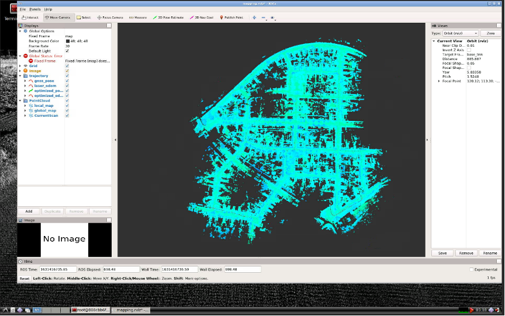
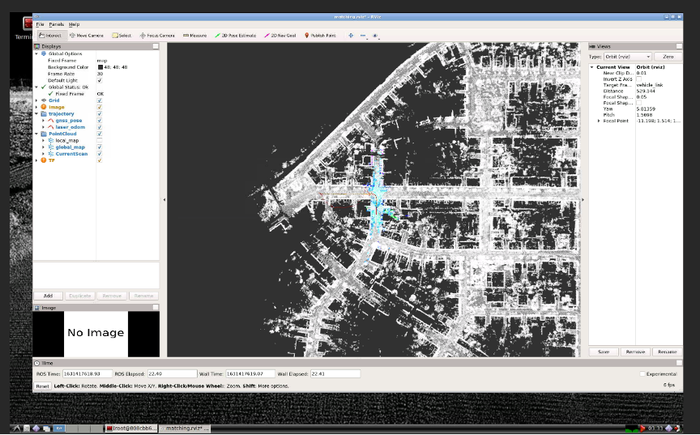
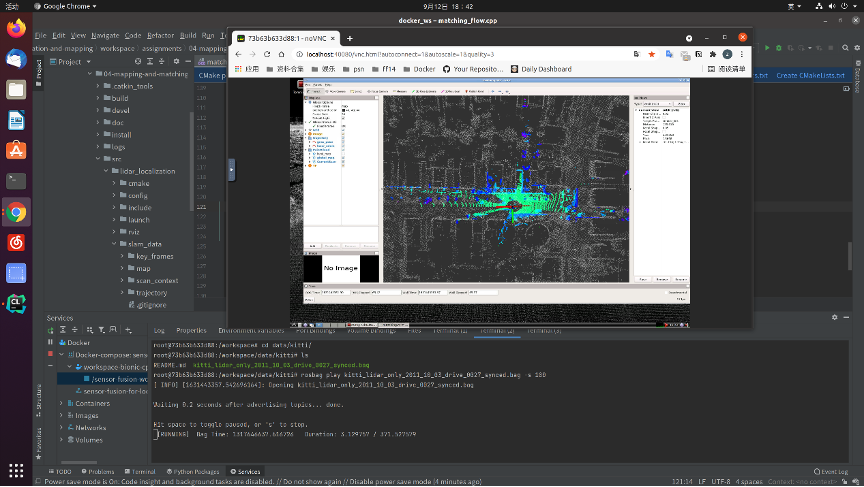
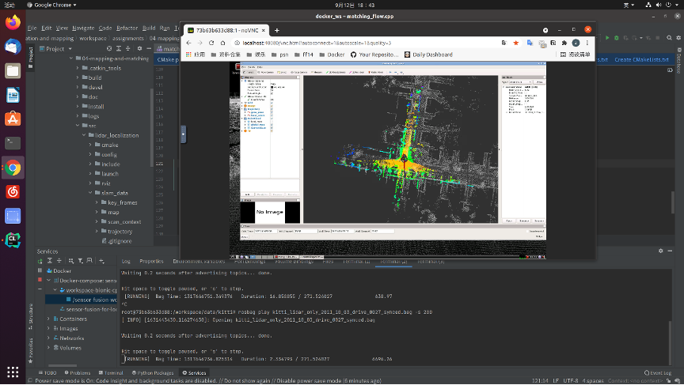
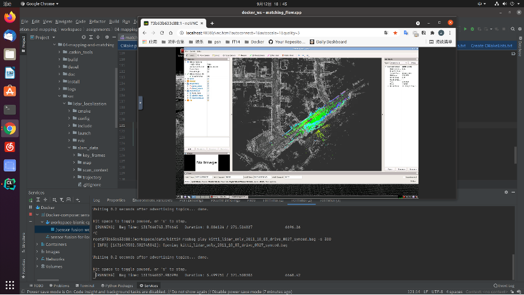
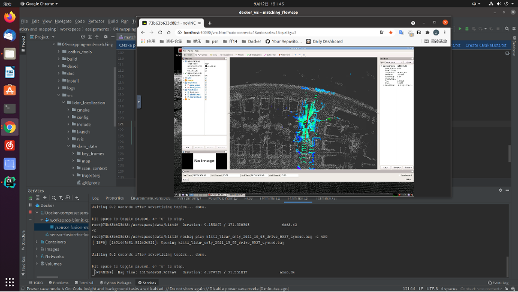

# Sensor Fusion for Localization and Mapping Lecture4 Homework

## 构建点云地图
根据[README.md](../../assignments/04-mapping-and-matching/README.md)的提示，运行相应指令，从而构建点云地图



## 完成基于点云地图在初始位置的重定位
根据[README.md](../../assignments/04-mapping-and-matching/README.md)的提示，运行相应指令，完成基于点云地图在初始位置的定位


## 完成基于点云地图的全局重定位
对matching_flow.cpp进行下面修改  
添加部分加载了两种重定位模式，分别为Scan Context和GNSS。当Scan Context不可用时使用GNSS重定位。
代码修改内容如下
```cpp
bool MatchingFlow::UpdateMatching() {
    if (!matching_ptr_->HasInited()) {
        //
        // TODO: implement global initialization here
        //
        // Hints: You can use SetGNSSPose & SetScanContextPose from matching.hpp
        //

        if(matching_ptr_->SetScanContextPose(current_cloud_data_)) {
            LOG(INFO) << "Scan Context Relocalization Succeeded !" << std::endl;
        }
        else{
            matching_ptr_->SetGNSSPose(current_gnss_data_.pose);
            LOG(INFO) << "GNSS Relocalization Succeeded !" << std::endl;
        }

        /*
        // naive implementation:
        Eigen::Matrix4f init_pose = Eigen::Matrix4f::Identity();
        
        matching_ptr_->SetInitPose(init_pose);
        matching_ptr_->SetInited();*/
    }

    return matching_ptr_->Update(current_cloud_data_, laser_odometry_);
}

```

1. 100s的重定位  


1. 200s的重定位  


1. 300s的重定位  


1. 400s的重定位  
