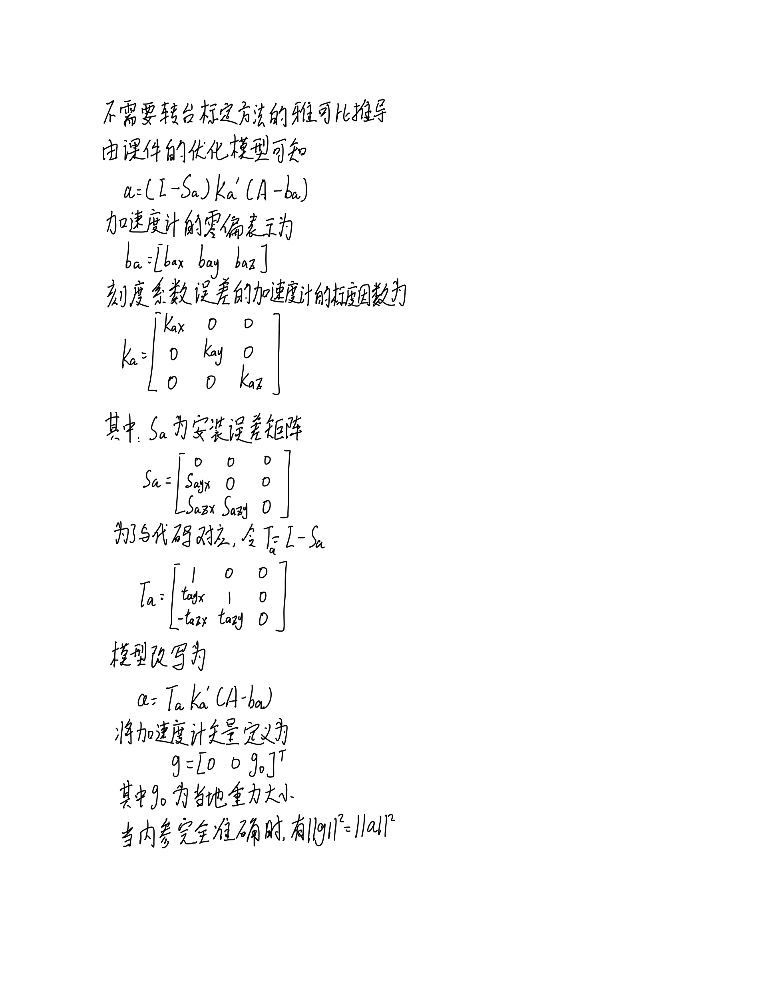
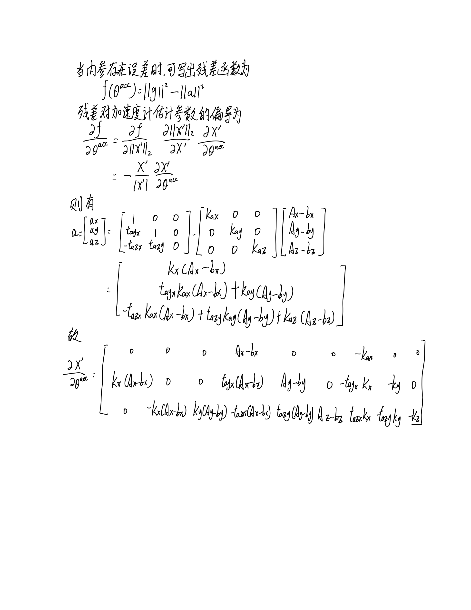
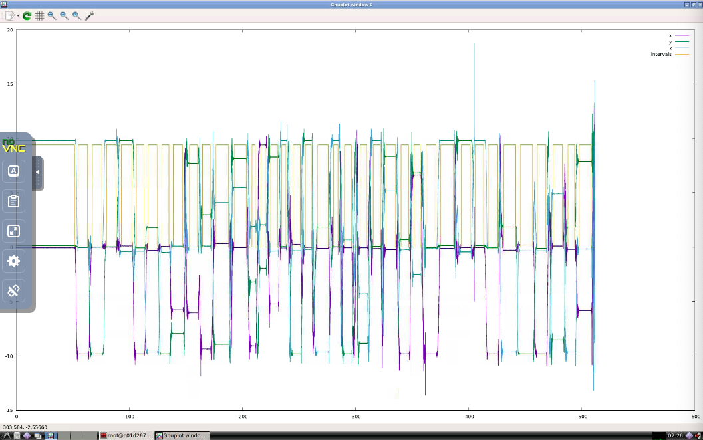
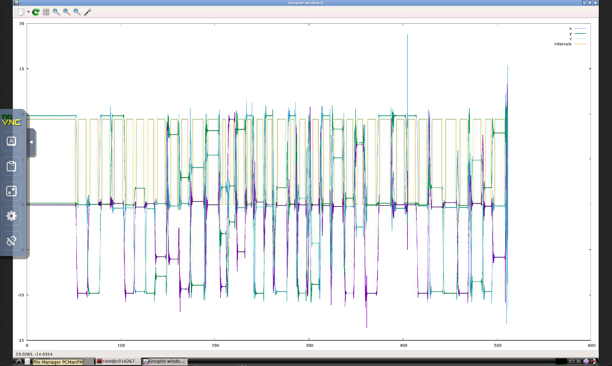

# Sensor Fusion for Localization and Mapping Lecture5 Homework

## 1. 加速度计残差雅克比
对不需要转台标定方法中所给出的内参模型及残差模型，推导加速度计对应残差对加速度内参的雅可比  

  


## 2. 加速度计的估计未使用解析式求导的标定
针对calibration.cpp文件内容修改
修改处1  
```cpp
/* assume body frame same as accelerometer frame, 
     * so bottom left params in the misalignment matris are set to zero */
    CalibratedTriad_<_T2> calib_triad( 
      //
      // TODO: implement lower triad model here
      //
      //! 将上三角修改为下三角
      // mis_yz, mis_zy, mis_zx:
      _T2(0), _T2(0), _T2(0),
      // mis_xz, mis_xy, mis_yx:
      params[0], params[1], params[2],
      //    s_x,    s_y,    s_z:
      params[3], params[4], params[5], 
      //    b_x,    b_y,    b_z: 
      params[6], params[7], params[8] 
    );
```  

修改处2  
```cpp
    //
    // TODO: implement lower triad model here
    //
    //  下三角参考calibration.h的对应位置，如下
    //  inline _T misXZ() const { return mis_mat_(1,0); };
    //  inline _T misXY() const { return -mis_mat_(2,0); };
    //  inline _T misYX() const { return mis_mat_(2,1); };
    acc_calib_params[0] = init_acc_calib_.misXZ();
    acc_calib_params[1] = init_acc_calib_.misXY();
    acc_calib_params[2] = init_acc_calib_.misYX();
```   

修改处3  
```cpp
acc_calib_ = CalibratedTriad_<_T>( 
    //
    // TODO: implement lower triad model here
    // 
    //! 修改为下三角形式
    0,0,0,
    min_cost_calib_params[0],
    min_cost_calib_params[1],
    min_cost_calib_params[2],
    min_cost_calib_params[3],
    min_cost_calib_params[4],
    min_cost_calib_params[5],
    min_cost_calib_params[6],
    min_cost_calib_params[7],
    min_cost_calib_params[8] 
  );
```  

输出显示  
```bash
Accelerometers Calibration: Extracted 42 intervals using threshold multiplier 2 -> Trying calibrate... 
iter      cost      cost_change  |gradient|   |step|    tr_ratio  tr_radius  ls_iter  iter_time  total_time
   0  3.399567e+10    0.00e+00    3.17e+10   0.00e+00   0.00e+00  1.00e+04        0    6.71e-03    7.14e-03
   1  2.700191e+03    3.40e+10    5.32e+06   2.63e+00   1.00e+00  3.00e+04        1    9.06e-03    1.63e-02
   2  2.278048e+01    2.68e+03    6.95e+05   7.16e+02   9.92e-01  9.00e+04        1    7.75e-03    2.41e-02
   3  1.366645e-01    2.26e+01    7.18e+03   3.18e+01   1.00e+00  2.70e+05        1    7.89e-03    3.20e-02
   4  1.347244e-01    1.94e-03    1.18e+00   4.74e-01   1.00e+00  8.10e+05        1    7.57e-03    3.97e-02
residual 0.134724
Accelerometers Calibration: Extracted 40 intervals using threshold multiplier 3 -> Trying calibrate... 
iter      cost      cost_change  |gradient|   |step|    tr_ratio  tr_radius  ls_iter  iter_time  total_time
   0  3.189931e+10    0.00e+00    2.76e+10   0.00e+00   0.00e+00  1.00e+04        0    6.54e-03    6.79e-03
   1  2.343289e+03    3.19e+10    3.46e+06   2.60e+00   1.00e+00  3.00e+04        1    8.11e-03    1.50e-02
   2  2.118105e+01    2.32e+03    6.06e+05   7.18e+02   9.91e-01  9.00e+04        1    7.31e-03    2.23e-02
   3  1.332983e-01    2.10e+01    6.87e+03   3.17e+01   1.00e+00  2.70e+05        1    7.02e-03    2.94e-02
   4  1.313451e-01    1.95e-03    1.04e+00   4.89e-01   1.00e+00  8.10e+05        1    8.15e-03    3.76e-02
residual 0.131345
Accelerometers Calibration: Extracted 39 intervals using threshold multiplier 4 -> Trying calibrate... 
iter      cost      cost_change  |gradient|   |step|    tr_ratio  tr_radius  ls_iter  iter_time  total_time
   0  3.112881e+10    0.00e+00    2.73e+10   0.00e+00   0.00e+00  1.00e+04        0    5.91e-03    6.14e-03
   1  2.310335e+03    3.11e+10    3.40e+06   2.61e+00   1.00e+00  3.00e+04        1    8.43e-03    1.46e-02
   2  2.117401e+01    2.29e+03    6.06e+05   7.18e+02   9.91e-01  9.00e+04        1    7.75e-03    2.24e-02
   3  1.279232e-01    2.10e+01    6.76e+03   3.00e+01   1.00e+00  2.70e+05        1    7.29e-03    2.98e-02
   4  1.261258e-01    1.80e-03    9.99e-01   4.65e-01   1.00e+00  8.10e+05        1    7.34e-03    3.72e-02
residual 0.126126
Accelerometers Calibration: Extracted 38 intervals using threshold multiplier 5 -> Trying calibrate... 
iter      cost      cost_change  |gradient|   |step|    tr_ratio  tr_radius  ls_iter  iter_time  total_time
   0  3.020722e+10    0.00e+00    2.59e+10   0.00e+00   0.00e+00  1.00e+04        0    6.18e-03    6.41e-03
   1  2.236142e+03    3.02e+10    2.96e+06   2.60e+00   1.00e+00  3.00e+04        1    6.96e-03    1.34e-02
   2  2.057339e+01    2.22e+03    5.82e+05   7.19e+02   9.91e-01  9.00e+04        1    6.41e-03    1.99e-02
   3  1.223695e-01    2.05e+01    6.81e+03   3.01e+01   1.00e+00  2.70e+05        1    6.90e-03    2.69e-02
   4  1.205582e-01    1.81e-03    1.02e+00   4.70e-01   1.00e+00  8.10e+05        1    7.36e-03    3.43e-02
residual 0.120558
Accelerometers Calibration: Extracted 38 intervals using threshold multiplier 6 -> Trying calibrate... 
iter      cost      cost_change  |gradient|   |step|    tr_ratio  tr_radius  ls_iter  iter_time  total_time
   0  3.020735e+10    0.00e+00    2.59e+10   0.00e+00   0.00e+00  1.00e+04        0    6.10e-03    6.29e-03
   1  2.236228e+03    3.02e+10    2.96e+06   2.60e+00   1.00e+00  3.00e+04        1    7.00e-03    1.34e-02
   2  2.057615e+01    2.22e+03    5.82e+05   7.19e+02   9.91e-01  9.00e+04        1    6.37e-03    1.98e-02
   3  1.219430e-01    2.05e+01    6.81e+03   3.01e+01   1.00e+00  2.70e+05        1    7.02e-03    2.68e-02
   4  1.201312e-01    1.81e-03    1.02e+00   4.70e-01   1.00e+00  8.10e+05        1    7.32e-03    3.42e-02
residual 0.120131
Accelerometers Calibration: Extracted 38 intervals using threshold multiplier 7 -> Trying calibrate... 
iter      cost      cost_change  |gradient|   |step|    tr_ratio  tr_radius  ls_iter  iter_time  total_time
   0  3.020749e+10    0.00e+00    2.59e+10   0.00e+00   0.00e+00  1.00e+04        0    6.22e-03    6.47e-03
   1  2.236258e+03    3.02e+10    2.96e+06   2.60e+00   1.00e+00  3.00e+04        1    7.24e-03    1.38e-02
   2  2.058955e+01    2.22e+03    5.82e+05   7.19e+02   9.91e-01  9.00e+04        1    6.40e-03    2.02e-02
   3  1.223945e-01    2.05e+01    6.80e+03   3.00e+01   1.00e+00  2.70e+05        1    6.55e-03    2.68e-02
   4  1.205858e-01    1.81e-03    1.02e+00   4.70e-01   1.00e+00  8.10e+05        1    7.06e-03    3.39e-02
residual 0.120586
Accelerometers Calibration: Extracted 38 intervals using threshold multiplier 8 -> Trying calibrate... 
iter      cost      cost_change  |gradient|   |step|    tr_ratio  tr_radius  ls_iter  iter_time  total_time
   0  3.020772e+10    0.00e+00    2.59e+10   0.00e+00   0.00e+00  1.00e+04        0    6.01e-03    6.23e-03
   1  2.236155e+03    3.02e+10    2.96e+06   2.60e+00   1.00e+00  3.00e+04        1    7.17e-03    1.35e-02
   2  2.059116e+01    2.22e+03    5.82e+05   7.19e+02   9.91e-01  9.00e+04        1    6.49e-03    2.00e-02
   3  1.231485e-01    2.05e+01    6.81e+03   3.00e+01   1.00e+00  2.70e+05        1    6.76e-03    2.69e-02
   4  1.213383e-01    1.81e-03    1.02e+00   4.70e-01   1.00e+00  8.10e+05        1    6.52e-03    3.34e-02
residual 0.121338
Accelerometers Calibration: Extracted 38 intervals using threshold multiplier 9 -> Trying calibrate... 
iter      cost      cost_change  |gradient|   |step|    tr_ratio  tr_radius  ls_iter  iter_time  total_time
   0  3.020772e+10    0.00e+00    2.59e+10   0.00e+00   0.00e+00  1.00e+04        0    6.91e-03    7.15e-03
   1  2.236261e+03    3.02e+10    2.96e+06   2.60e+00   1.00e+00  3.00e+04        1    7.09e-03    1.43e-02
   2  2.058975e+01    2.22e+03    5.82e+05   7.19e+02   9.91e-01  9.00e+04        1    6.68e-03    2.10e-02
   3  1.232319e-01    2.05e+01    6.81e+03   3.00e+01   1.00e+00  2.70e+05        1    7.32e-03    2.84e-02
   4  1.214222e-01    1.81e-03    1.02e+00   4.70e-01   1.00e+00  8.10e+05        1    6.55e-03    3.50e-02
residual 0.121422
Accelerometers Calibration: Extracted 38 intervals using threshold multiplier 10 -> Trying calibrate... 
iter      cost      cost_change  |gradient|   |step|    tr_ratio  tr_radius  ls_iter  iter_time  total_time
   0  3.020750e+10    0.00e+00    2.59e+10   0.00e+00   0.00e+00  1.00e+04        0    6.22e-03    6.45e-03
   1  2.237162e+03    3.02e+10    2.96e+06   2.61e+00   1.00e+00  3.00e+04        1    6.87e-03    1.34e-02
   2  2.065169e+01    2.22e+03    5.83e+05   7.19e+02   9.91e-01  9.00e+04        1    7.01e-03    2.04e-02
   3  1.400352e-01    2.05e+01    6.78e+03   2.99e+01   1.00e+00  2.70e+05        1    7.16e-03    2.76e-02
   4  1.382403e-01    1.79e-03    1.05e+00   4.67e-01   1.00e+00  8.10e+05        1    7.22e-03    3.49e-02
residual 0.13824
Accelerometers calibration: Better calibration obtained using threshold multiplier 6 with residual 0.120131
Misalignment Matrix
          1          -0           0
-0.00354989           1          -0
-0.00890444  -0.0213032           1
Scale Matrix
0.00241267          0          0
         0 0.00242659          0
         0          0 0.00241232
Bias Vector
33124.2
33275.2
32364.4

Accelerometers calibration: inverse scale factors:
414.478
412.102
414.538

Press Enter to continue
QStandardPaths: XDG_RUNTIME_DIR not set, defaulting to '/tmp/runtime-root'

Gyroscopes calibration: calibrating...
iter      cost      cost_change  |gradient|   |step|    tr_ratio  tr_radius  ls_iter  iter_time  total_time
   0  8.608408e+00    0.00e+00    1.33e+05   0.00e+00   0.00e+00  1.00e+04        0    7.50e-02    7.51e-02
   1  3.325769e-01    8.28e+00    2.64e+04   6.50e-02   1.27e+00  3.00e+04        1    7.62e-02    1.51e-01
   2  1.618295e-03    3.31e-01    3.64e+02   4.35e-02   1.01e+00  9.00e+04        1    7.92e-02    2.31e-01
   3  1.506957e-03    1.11e-04    1.17e+00   2.17e-03   1.00e+00  2.70e+05        1    8.02e-02    3.11e-01
   4  1.506956e-03    1.51e-09    4.85e-03   1.13e-05   1.00e+00  8.10e+05        1    6.85e-02    3.79e-01

Solver Summary (v 2.0.0-eigen-(3.3.4)-lapack-suitesparse-(5.1.2)-cxsparse-(3.1.9)-eigensparse-no_openmp)

                                     Original                  Reduced
Parameter blocks                            1                        1
Parameters                                  9                        9
Residual blocks                            37                       37
Residuals                                 111                      111

Minimizer                        TRUST_REGION

Dense linear algebra library            EIGEN
Trust region strategy     LEVENBERG_MARQUARDT

                                        Given                     Used
Linear solver                        DENSE_QR                 DENSE_QR
Threads                                     1                        1
Linear solver ordering              AUTOMATIC                        1

Cost:
Initial                          8.608408e+00
Final                            1.506956e-03
Change                           8.606901e+00

Minimizer iterations                        5
Successful steps                            5
Unsuccessful steps                          0

Time (in seconds):
Preprocessor                         0.000149

  Residual only evaluation           0.007516 (5)
  Jacobian & residual evaluation     0.372717 (5)
  Linear solver                      0.000165 (5)
Minimizer                            0.380874

Postprocessor                        0.000004
Total                                0.381027

Termination:                      CONVERGENCE (Function tolerance reached. |cost_change|/cost: 1.098767e-11 <= 1.000000e-06)

Gyroscopes calibration: residual 0.00150696
Misalignment Matrix
         1 0.00927517 0.00990014
0.00507442          1 -0.0322229
 0.0162201 -0.0239393          1
Scale Matrix
0.000209338           0           0
          0 0.000209834           0
          0           0 0.000209664
Bias Vector
32777.1
32459.8
32511.8

Gyroscopes calibration: inverse scale factors:
4776.96
4765.68
4769.53
```  

输出截图展示


## 3. 解析式求导完成标定 
针对calibration.cpp文件内容修改  
修改处1：增加ceres解析求导的功能函数，代码如下  
```cpp
/**
 * @brief 使用解析求导的方式来求解
 */
template <typename _T1>
class AnalyticMultiPosAccResidual : public ceres::SizedCostFunction<1, 9> {
  public:
    /**
     * @param g_mag 重力加速度，对应公式的g
     * @param sample 测量加速度，对应公式的a
     */ 
    AnalyticMultiPosAccResidual(const _T1 &g_mag, const Eigen::Matrix< _T1, 3 , 1> &sample)
      : g_mag_(g_mag), sample_(sample) {}
    
    virtual ~AnalyticMultiPosAccResidual() {}

    /**
     * @param params 
     * @param residuals 残差项
     * @param jacobians 解析求导用的雅克比项
     */ 
    virtual bool Evaluate(double const* const* params, double *residuals, double **jacobians) const {
        // 将需要优化的参数改写成相应的误差矩阵
        const double tayx = params[0][0];
        const double tazx = params[0][1];
        const double tazy = params[0][2];
        const double Kax = params[0][3];
        const double Kay = params[0][4];
        const double Kaz = params[0][5];
        const double bax = params[0][6];
        const double bay = params[0][7];
        const double baz = params[0][8];

        // 下三角模型
        // 安装误差矩阵，对应公式的Ta
        Eigen::Matrix<double, 3, 3> Ta;
        Ta << 1   , 0   , 0, 
             tayx , 1   , 0, 
             -tazx, tazy , 1;
        
        // 刻度系数误差的加速度计的标度因数矩阵，对应公式的Ka
        Eigen::Matrix3d Ka = Eigen::Matrix3d::Identity();
        Ka(0, 0) = Kax;
        Ka(1, 1) = Kay;
        Ka(2, 2) = Kaz;

        // 零偏相关的偏差向量，对应公式的ba
        Eigen::Vector3d ba(bax, bay, baz);
        
        // 对应推导的A，构建其Eigen形式
        Eigen::Matrix<double,3,1 > A(double(sample_(0)),double(sample_(1)),double(sample_(2)));

        // 优化模型形式
        Eigen::Vector3d a = Ta * Ka * (A.col(0) - ba);

        // 残差形式
        residuals[0] = g_mag_ - a.norm();

        // 解析式推导的雅克比形式
        if (jacobians != nullptr) {
            if (jacobians[0] != nullptr) {

                // 对应公式中链式法则求导的第一项
                Eigen::Vector3d x = a / (a.norm());

                // 测量值减去ba
                Eigen::Vector3d v = A.col(0) - ba;
                // a 对参数的偏导
                Eigen::Matrix<double, 3, 9> J_theta = Eigen::Matrix<double, 3, 9>::Zero();

                // 对应链式求导的第二项，里面的项与公式推导的相对应
                J_theta(0, 3) = v(0);
                J_theta(0, 6) = -Kax;
                J_theta(1, 0) = Kax * v(0);
                J_theta(1, 3) = tayx * v(0);
                J_theta(1, 4) = v(1);
                J_theta(1, 6) = -tayx * Kax;
                J_theta(1, 7) = -Kay;
                J_theta(2, 1) = -Kax * v(0);
                J_theta(2, 2) = Kay * v(1);
                J_theta(2, 3) = -tazx * v(0);
                J_theta(2, 4) = tazy * v(1);
                J_theta(2, 5) = v(2);
                J_theta(2, 6) = tazx * Kax;
                J_theta(2, 7) = -tazy * Kay;
                J_theta(2, 8) = -Kaz;

                // 对应公式的链式法则，将第一项和第二项相乘
                Eigen::Matrix<double, 1, 9> Jacobians = - x.transpose() * J_theta;

                // 数据类型转换
                jacobians[0][0] = Jacobians(0, 0);
                jacobians[0][1] = Jacobians(0, 1);
                jacobians[0][2] = Jacobians(0, 2);
                jacobians[0][3] = Jacobians(0, 3);
                jacobians[0][4] = Jacobians(0, 4);
                jacobians[0][5] = Jacobians(0, 5);
                jacobians[0][6] = Jacobians(0, 6);
                jacobians[0][7] = Jacobians(0, 7);
                jacobians[0][8] = Jacobians(0, 8);
            }
        }
        return true;
    }

  private:
    const _T1 g_mag_;
    const Eigen::Matrix< _T1, 3 , 1> sample_;
};
```  
修改处2： 对bool MultiPosCalibration_<_T>::calibrateAcc函数进行修改，增加使用解析求导的部分   
```cpp
ceres::Problem problem;
    for( int i = 0; i < static_samples.size(); i++)
    {
      /*
      ceres::CostFunction* cost_function = MultiPosAccResidual<_T>::Create ( 
        g_mag_, static_samples[i].data() 
      );*/

      // ！更改为解析式求导
      ceres::CostFunction *cost_function = new AnalyticMultiPosAccResidual<_T>(g_mag_, static_samples[i].data());

      problem.AddResidualBlock ( 
        cost_function,           /* error fuction */
        NULL,                    /* squared loss */
        acc_calib_params.data()  /* accel deterministic error params */
      ); 
    }
```

输出显示  
```bash
Accelerometer Calibration: Calibrating...
Accelerometers Calibration: Extracted 42 intervals using threshold multiplier 2 -> Trying calibrate... 
iter      cost      cost_change  |gradient|   |step|    tr_ratio  tr_radius  ls_iter  iter_time  total_time
   0  3.399567e+10    0.00e+00    3.17e+10   0.00e+00   0.00e+00  1.00e+04        0    5.04e-04    9.42e-04
   1  2.700191e+03    3.40e+10    5.32e+06   2.63e+00   1.00e+00  3.00e+04        1    1.35e-03    2.36e-03
   2  2.278048e+01    2.68e+03    6.95e+05   7.16e+02   9.92e-01  9.00e+04        1    1.02e-03    3.42e-03
   3  1.366645e-01    2.26e+01    7.18e+03   3.18e+01   1.00e+00  2.70e+05        1    1.21e-03    4.66e-03
   4  1.347244e-01    1.94e-03    1.18e+00   4.74e-01   1.00e+00  8.10e+05        1    1.02e-03    5.72e-03
residual 0.134724
Accelerometers Calibration: Extracted 40 intervals using threshold multiplier 3 -> Trying calibrate... 
iter      cost      cost_change  |gradient|   |step|    tr_ratio  tr_radius  ls_iter  iter_time  total_time
   0  3.189931e+10    0.00e+00    2.76e+10   0.00e+00   0.00e+00  1.00e+04        0    4.74e-04    6.73e-04
   1  2.343289e+03    3.19e+10    3.46e+06   2.60e+00   1.00e+00  3.00e+04        1    8.98e-04    1.61e-03
   2  2.118105e+01    2.32e+03    6.06e+05   7.18e+02   9.91e-01  9.00e+04        1    8.75e-04    2.52e-03
   3  1.332983e-01    2.10e+01    6.87e+03   3.17e+01   1.00e+00  2.70e+05        1    8.73e-04    3.42e-03
   4  1.313451e-01    1.95e-03    1.04e+00   4.89e-01   1.00e+00  8.10e+05        1    8.97e-04    4.35e-03
residual 0.131345
Accelerometers Calibration: Extracted 39 intervals using threshold multiplier 4 -> Trying calibrate... 
iter      cost      cost_change  |gradient|   |step|    tr_ratio  tr_radius  ls_iter  iter_time  total_time
   0  3.112881e+10    0.00e+00    2.73e+10   0.00e+00   0.00e+00  1.00e+04        0    4.88e-04    6.77e-04
   1  2.310335e+03    3.11e+10    3.40e+06   2.61e+00   1.00e+00  3.00e+04        1    8.69e-04    1.59e-03
   2  2.117401e+01    2.29e+03    6.06e+05   7.18e+02   9.91e-01  9.00e+04        1    8.33e-04    2.45e-03
   3  1.279232e-01    2.10e+01    6.76e+03   3.00e+01   1.00e+00  2.70e+05        1    8.77e-04    3.39e-03
   4  1.261258e-01    1.80e-03    9.99e-01   4.65e-01   1.00e+00  8.10e+05        1    8.69e-04    4.29e-03
residual 0.126126
Accelerometers Calibration: Extracted 38 intervals using threshold multiplier 5 -> Trying calibrate... 
iter      cost      cost_change  |gradient|   |step|    tr_ratio  tr_radius  ls_iter  iter_time  total_time
   0  3.020722e+10    0.00e+00    2.59e+10   0.00e+00   0.00e+00  1.00e+04        0    6.14e-04    8.62e-04
   1  2.236142e+03    3.02e+10    2.96e+06   2.60e+00   1.00e+00  3.00e+04        1    9.80e-04    1.89e-03
   2  2.057339e+01    2.22e+03    5.82e+05   7.19e+02   9.91e-01  9.00e+04        1    9.54e-04    2.87e-03
   3  1.223695e-01    2.05e+01    6.81e+03   3.01e+01   1.00e+00  2.70e+05        1    9.15e-04    3.82e-03
   4  1.205582e-01    1.81e-03    1.02e+00   4.70e-01   1.00e+00  8.10e+05        1    9.67e-04    4.82e-03
residual 0.120558
Accelerometers Calibration: Extracted 38 intervals using threshold multiplier 6 -> Trying calibrate... 
iter      cost      cost_change  |gradient|   |step|    tr_ratio  tr_radius  ls_iter  iter_time  total_time
   0  3.020735e+10    0.00e+00    2.59e+10   0.00e+00   0.00e+00  1.00e+04        0    8.52e-04    1.05e-03
   1  2.236228e+03    3.02e+10    2.96e+06   2.60e+00   1.00e+00  3.00e+04        1    1.69e-03    2.81e-03
   2  2.057615e+01    2.22e+03    5.82e+05   7.19e+02   9.91e-01  9.00e+04        1    9.23e-04    3.78e-03
   3  1.219430e-01    2.05e+01    6.81e+03   3.01e+01   1.00e+00  2.70e+05        1    8.55e-04    4.67e-03
   4  1.201312e-01    1.81e-03    1.02e+00   4.70e-01   1.00e+00  8.10e+05        1    9.69e-04    5.67e-03
residual 0.120131
Accelerometers Calibration: Extracted 38 intervals using threshold multiplier 7 -> Trying calibrate... 
iter      cost      cost_change  |gradient|   |step|    tr_ratio  tr_radius  ls_iter  iter_time  total_time
   0  3.020749e+10    0.00e+00    2.59e+10   0.00e+00   0.00e+00  1.00e+04        0    4.77e-04    6.43e-04
   1  2.236258e+03    3.02e+10    2.96e+06   2.60e+00   1.00e+00  3.00e+04        1    9.94e-04    1.68e-03
   2  2.058955e+01    2.22e+03    5.82e+05   7.19e+02   9.91e-01  9.00e+04        1    8.77e-04    2.60e-03
   3  1.223945e-01    2.05e+01    6.80e+03   3.00e+01   1.00e+00  2.70e+05        1    8.05e-04    3.43e-03
   4  1.205858e-01    1.81e-03    1.02e+00   4.70e-01   1.00e+00  8.10e+05        1    8.59e-04    4.32e-03
residual 0.120586
Accelerometers Calibration: Extracted 38 intervals using threshold multiplier 8 -> Trying calibrate... 
iter      cost      cost_change  |gradient|   |step|    tr_ratio  tr_radius  ls_iter  iter_time  total_time
   0  3.020772e+10    0.00e+00    2.59e+10   0.00e+00   0.00e+00  1.00e+04        0    5.56e-04    7.96e-04
   1  2.236155e+03    3.02e+10    2.96e+06   2.60e+00   1.00e+00  3.00e+04        1    1.04e-03    1.94e-03
   2  2.059116e+01    2.22e+03    5.82e+05   7.19e+02   9.91e-01  9.00e+04        1    1.08e-03    3.12e-03
   3  1.231485e-01    2.05e+01    6.81e+03   3.00e+01   1.00e+00  2.70e+05        1    9.48e-04    4.10e-03
   4  1.213383e-01    1.81e-03    1.02e+00   4.70e-01   1.00e+00  8.10e+05        1    1.12e-03    5.28e-03
residual 0.121338
Accelerometers Calibration: Extracted 38 intervals using threshold multiplier 9 -> Trying calibrate... 
iter      cost      cost_change  |gradient|   |step|    tr_ratio  tr_radius  ls_iter  iter_time  total_time
   0  3.020772e+10    0.00e+00    2.59e+10   0.00e+00   0.00e+00  1.00e+04        0    4.55e-04    6.42e-04
   1  2.236261e+03    3.02e+10    2.96e+06   2.60e+00   1.00e+00  3.00e+04        1    8.54e-04    1.53e-03
   2  2.058975e+01    2.22e+03    5.82e+05   7.19e+02   9.91e-01  9.00e+04        1    9.33e-04    2.50e-03
   3  1.232319e-01    2.05e+01    6.81e+03   3.00e+01   1.00e+00  2.70e+05        1    9.15e-04    3.45e-03
   4  1.214222e-01    1.81e-03    1.02e+00   4.70e-01   1.00e+00  8.10e+05        1    9.79e-04    4.46e-03
residual 0.121422
Accelerometers Calibration: Extracted 38 intervals using threshold multiplier 10 -> Trying calibrate... 
iter      cost      cost_change  |gradient|   |step|    tr_ratio  tr_radius  ls_iter  iter_time  total_time
   0  3.020750e+10    0.00e+00    2.59e+10   0.00e+00   0.00e+00  1.00e+04        0    6.15e-04    7.85e-04
   1  2.237162e+03    3.02e+10    2.96e+06   2.61e+00   1.00e+00  3.00e+04        1    1.07e-03    1.94e-03
   2  2.065169e+01    2.22e+03    5.83e+05   7.19e+02   9.91e-01  9.00e+04        1    1.04e-03    3.02e-03
   3  1.400352e-01    2.05e+01    6.78e+03   2.99e+01   1.00e+00  2.70e+05        1    8.89e-04    3.95e-03
   4  1.382403e-01    1.79e-03    1.05e+00   4.67e-01   1.00e+00  8.10e+05        1    8.87e-04    4.86e-03
residual 0.13824
Accelerometers calibration: Better calibration obtained using threshold multiplier 6 with residual 0.120131
Misalignment Matrix
          1          -0           0
-0.00354989           1          -0
-0.00890444  -0.0213032           1
Scale Matrix
0.00241267          0          0
         0 0.00242659          0
         0          0 0.00241232
Bias Vector
33124.2
33275.2
32364.4

Accelerometers calibration: inverse scale factors:
414.478
412.102
414.538

Press Enter to continue
QStandardPaths: XDG_RUNTIME_DIR not set, defaulting to '/tmp/runtime-root'

Gyroscopes calibration: calibrating...
iter      cost      cost_change  |gradient|   |step|    tr_ratio  tr_radius  ls_iter  iter_time  total_time
   0  8.608408e+00    0.00e+00    1.33e+05   0.00e+00   0.00e+00  1.00e+04        0    6.52e-02    6.52e-02
   1  3.325769e-01    8.28e+00    2.64e+04   6.50e-02   1.27e+00  3.00e+04        1    5.97e-02    1.25e-01
   2  1.618295e-03    3.31e-01    3.64e+02   4.35e-02   1.01e+00  9.00e+04        1    7.03e-02    1.95e-01
   3  1.506957e-03    1.11e-04    1.17e+00   2.17e-03   1.00e+00  2.70e+05        1    6.47e-02    2.60e-01
   4  1.506956e-03    1.51e-09    4.85e-03   1.13e-05   1.00e+00  8.10e+05        1    6.40e-02    3.24e-01

Solver Summary (v 2.0.0-eigen-(3.3.4)-lapack-suitesparse-(5.1.2)-cxsparse-(3.1.9)-eigensparse-no_openmp)

                                     Original                  Reduced
Parameter blocks                            1                        1
Parameters                                  9                        9
Residual blocks                            37                       37
Residuals                                 111                      111

Minimizer                        TRUST_REGION

Dense linear algebra library            EIGEN
Trust region strategy     LEVENBERG_MARQUARDT

                                        Given                     Used
Linear solver                        DENSE_QR                 DENSE_QR
Threads                                     1                        1
Linear solver ordering              AUTOMATIC                        1

Cost:
Initial                          8.608408e+00
Final                            1.506956e-03
Change                           8.606901e+00

Minimizer iterations                        5
Successful steps                            5
Unsuccessful steps                          0

Time (in seconds):
Preprocessor                         0.000051

  Residual only evaluation           0.007883 (5)
  Jacobian & residual evaluation     0.317469 (5)
  Linear solver                      0.000082 (5)
Minimizer                            0.325801

Postprocessor                        0.000004
Total                                0.325856

Termination:                      CONVERGENCE (Function tolerance reached. |cost_change|/cost: 1.103444e-11 <= 1.000000e-06)

Gyroscopes calibration: residual 0.00150696
Misalignment Matrix
         1 0.00927517 0.00990014
0.00507442          1 -0.0322229
 0.0162201 -0.0239393          1
Scale Matrix
0.000209338           0           0
          0 0.000209834           0
          0           0 0.000209664
Bias Vector
32777.1
32459.8
32511.8

Gyroscopes calibration: inverse scale factors:
4776.96
4765.68
4769.53
```

输出截图展示：

