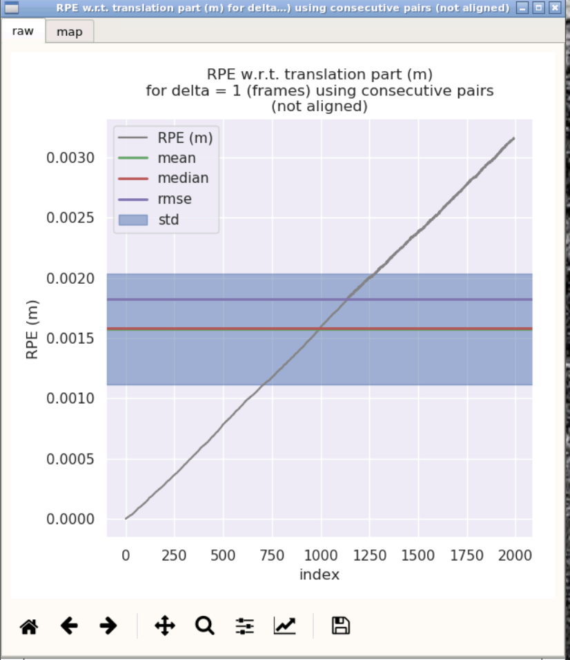

# Sensor Fusion for Localization and Mapping Lecture6 Homework

## 1. 根据课程给定的数据，完成基于中值法的解算;
针对activity.cpp文件进行修改  
```c++
bool Activity::UpdatePose(void) {
    if (!initialized_) {
        // use the latest measurement for initialization:
        // 使用最后一次的里程计进行初始化：
        OdomData &odom_data = odom_data_buff_.back();
        IMUData imu_data = imu_data_buff_.back();

        pose_ = odom_data.pose;
        vel_ = odom_data.vel;

        initialized_ = true;

        odom_data_buff_.clear();
        imu_data_buff_.clear();

        // keep the latest IMU measurement for mid-value integration:
        // 使用最新的IMU测量值进行中值法解算
        imu_data_buff_.push_back(imu_data);
    } else {
        //
        // TODO: implement your estimation here
        // 估计的解算过程
        //
        // get deltas:
        // 获取角度
        Eigen::Vector3d deltas = Eigen::Vector3d::Zero();
        GetAngularDelta(1, 0, deltas);

        // update orientation:
        // 更新旋转
        Eigen::Matrix3d R_curr = Eigen::Matrix3d::Identity();
        Eigen::Matrix3d R_prev = Eigen::Matrix3d::Identity();
        UpdateOrientation(deltas, R_curr, R_prev);

        // get velocity delta:
        // 获得速度
        double delta_t = 0;
        Eigen::Vector3d velocity_delta = Eigen::Vector3d::Zero();
        GetVelocityDelta(1, 0, R_curr, R_prev, delta_t, velocity_delta);

        // update position:
        // 更新位置
        UpdatePosition(delta_t, velocity_delta);

        // move forward -- 
        // NOTE: this is NOT fixed. you should update your buffer according to the method of your choice:
        // 移除最早的数据
        imu_data_buff_.pop_front();
    }
    
    return true;
}

}
```  

结果如下：
  

## 2. 根据课程给定的数据，完成基于欧拉法的解算，并进行欧拉法与中值法的精度对比
1. 针对activity.cpp文件的bool Activity::GetAngularDelta函数进行修改  
```c++
    // mid-value
    // angular_delta = 0.5*delta_t*(angular_vel_curr + angular_vel_prev);
    // euler's-value
    angular_delta = delta_t*angular_vel_prev;
```

2. 针对activity.cpp文件的bool Activity::GetVelocityDelta函数进行修改  
```c++
    // mid-value
    // velocity_delta = 0.5*delta_t*(linear_acc_curr + linear_acc_prev);
    // euler's-value
    velocity_delta = delta_t* linear_acc_prev;
```  

结果如下：
  


## 3. 根据课程给定的数据，完成欧拉法与中值法的精度对比
为了使用evo工具进行分析，将要发布的数据存储为轨迹，例如，修改odom_subscriber.cpp
Ps. 本来想集成在activity里面的，但是试了很久没有成功，故分了两个部分来获取数据生成轨迹
```c++
void OdomSubscriber::msg_callback(
  const nav_msgs::OdometryConstPtr& odom_msg_ptr
) {
    buff_mutex_.lock();

    // convert ROS IMU to GeographicLib compatible GNSS message:
    OdomData odom_data;
    odom_data.time = odom_msg_ptr->header.stamp.toSec();

    Eigen::Quaterniond q(
      odom_msg_ptr->pose.pose.orientation.w,
      odom_msg_ptr->pose.pose.orientation.x,
      odom_msg_ptr->pose.pose.orientation.y,
      odom_msg_ptr->pose.pose.orientation.z
    );
    Eigen::Vector3d t(
      odom_msg_ptr->pose.pose.position.x,
      odom_msg_ptr->pose.pose.position.y,
      odom_msg_ptr->pose.pose.position.z      
    );

    odom_data.pose.block<3, 3>(0, 0) = q.toRotationMatrix();
    odom_data.pose.block<3, 1>(0, 3) = t;

    odom_data.vel = Eigen::Vector3d(
      odom_msg_ptr->twist.twist.linear.x,
      odom_msg_ptr->twist.twist.linear.y,
      odom_msg_ptr->twist.twist.linear.z 
    );

    // add new message to buffer:
    odom_data_.push_back(odom_data);
    
    buff_mutex_.unlock();

    static std::ofstream ground_truth;
    static bool is_file_created = false;
    std::string WORK_SPACE_PATH="/workspace/assignments/06-imu-navigation/src/imu_integration";
    
    if (!is_file_created) {
      CreateDirectory(WORK_SPACE_PATH + "/slam_data/trajectory");
      CreateFile(ground_truth, WORK_SPACE_PATH + "/slam_data/trajectory/ground_truth.txt");
      is_file_created = true;
    }
    

    // 解析轨迹数据
    Eigen::Matrix4d odom_pose = odom_data.pose;
    Eigen::Matrix4d trans = Eigen::Matrix4d::Zero();
    trans(0, 3) = odom_pose(0,3);
    trans(1,3) = odom_pose(1,3);
    trans(2,3) = odom_pose(2,3);

    Eigen::Quaterniond odom_q( odom_pose.block<3,3>(0,0) );
    trans.block<3,3>(0,0) = odom_q.toRotationMatrix();    

    // 存入数据
    for (int i = 0; i < 3; ++i) {
        for (int j = 0; j < 4; ++j) {
            ground_truth << odom_pose(i, j);
            if (i == 2 && j == 3) {
                ground_truth << std::endl;
            } else {
                ground_truth << " ";
            }
        }
    }

}
```
之后对生成的轨迹进行分析  
中值法的结果如下  
  
  
欧拉法的结果如下  
  
  
可以看出中值法的精度比欧拉法精度高  

## 4. 使用gnss_ins_sim包生成仿真数据
参考recorder_node_allan_variance_analysis.py，编写recorder_node_with_groundtruth.py，可以在生成仿真数据的基础上，同时有ground_truth，同时编写对应的recorder_node_with_groundtruth.launch
主要添加以下几个部分
```python
# c. ref_pos
sim.dmgr.get_data_all('ref_pos').data,
# d. ref_vel
sim.dmgr.get_data_all('ref_vel').data,
# e. ref_att_quat
sim.dmgr.get_data_all('ref_att_quat').data
```
```python
# c. ref_pos:
'ref_pos_x': ref_pos[0],
'ref_pos_y': ref_pos[1],
'ref_pos_z': ref_pos[2],
# d. ref_vel:
'ref_vel_x': ref_vel[0],
'ref_vel_y': ref_vel[1],
'ref_vel_z': ref_vel[2],
# e. ref_att_quat:
'ref_att_quat_w': ref_att_quat[0],
'ref_att_quat_x': ref_att_quat[1],
'ref_att_quat_y': ref_att_quat[2], 
'ref_att_quat_z': ref_att_quat[3]
```
```python
# init:
msg = Odometry()
# a. set header:
msg.header.frame_id = 'inertial'
msg.child_frame_id = 'inertial'
msg.header.stamp = timestamp_start + rospy.Duration.from_sec(measurement['stamp'])
## b. set orientation:
msg.pose.pose.orientation.x = measurement['data']['ref_att_quat_x']
msg.pose.pose.orientation.y = measurement['data']['ref_att_quat_y']
msg.pose.pose.orientation.z = measurement['data']['ref_att_quat_z']
msg.pose.pose.orientation.w = measurement['data']['ref_att_quat_w']
# c. set position:
msg.pose.pose.position.x = measurement['data']['ref_pos_x']-init_x
msg.pose.pose.position.y = measurement['data']['ref_pos_y']-init_y
msg.pose.pose.position.z = measurement['data']['ref_pos_z']-init_z
# c. set velocity:
msg.twist.twist.linear.x = measurement['data']['ref_vel_x']
msg.twist.twist.linear.y = measurement['data']['ref_vel_y']
msg.twist.twist.linear.z = measurement['data']['ref_vel_z']

# write:
bag.write('/pose/ground_truth', msg, msg.header.stamp)
```

再改写allan_variance_analysis.csv，添加不同的运动状况信息  
```
ini lat (deg),ini lon (deg),ini alt (m),ini vx_body (m/s),ini vy_body (m/s),ini vz_body (m/s),ini yaw (deg),ini pitch (deg),ini roll (deg)
31.224361,121.469170,0,0,0,0,0,0,0
command type,yaw (deg),pitch (deg),roll (deg),vx_body (m/s),vy_body (m/s),vz_body (m/s),command duration (s),GPS visibility
1,0,0,0,0,0,0,120,1
5,0,0,0,10,0,0,20,1
1,0,0,0,0,0,0,120,1
1,0,0,0,0.1,0,0,60,1
1,0,0,0,0,0,0,5,1
1,0,0,0,-0.2,0,0,60,1
3,90,0,0,0,0,0,60,1
1,0,0,0,0,0,0,30,1
1,0,0,0,10,0,0,60,1
1,0,0,0,0,0,0,5,1
1,0,0,0,-10,0,0,60,1
```  
之后便生成了data.bag

## 5. 利用IMU仿真程序，自己生成不同运动状况(静止、匀速、加减速、快速转弯等)的仿真数据，对比两种解算方法精度差异与运动状况的关系，并给出原因分析。
### 静止状态
中值法
  
  
  
欧拉法  
  
  
  
### 匀速状态   
中值法
  
  
  
欧拉法  
  
  
  
### 加减速状态   
中值法
  
  
  
欧拉法  
  
  
  
### 拐弯状态   
中值法
  
  
  
欧拉法  
  
  
  
结合课程数据和生成的仿真数据分析，当变化比较剧烈的情况下，欧拉法的精度比中值法的差。当变化比较缓和的情况下，两者的精度相似

