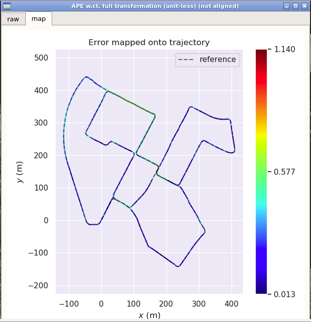

<!--
 * @Author your name
 * @Date 2021-10-08 15:47:59
 * @LastEditTime 2021-10-16 15:23:19
 * @LastEditors Please set LastEditors
 * @Description In User Settings Edit
 * @FilePath /workspace/doc/L7_hw/README.md
-->
# Sensor Fusion for Localization and Mapping Lecture7 Homework

## 1. 基于kitti数据集，补全代码，且滤波功能正常
代码修改部分如下：  
所有代码修改部分均在error_state_kalman_filter.cpp
### Init函数
---
由于课程的公式均在body坐标系下进行操作，对加速度均值的计算进行相应修改
```cpp  
  // covert to navigation frame:
  // 转换坐标系，课程使用的是body坐标系
  // TODO!: 遗留错误修改
  linear_acc_init = linear_acc_init - accl_bias_;
```  
### UpdateOdomEstimation()函数
---
对该函数进行修改，主要对应的是3.惯性阶段的内容
```c++
void ErrorStateKalmanFilter::UpdateOdomEstimation(
    Eigen::Vector3d &linear_acc_mid, Eigen::Vector3d &angular_vel_mid) {
  //
  // TODO!: this is one possible solution to previous chapter, IMU Navigation,
  // 填充相应内容，并修改GetVelocityDelta内容
  // 对应3. 惯性解算内容
  // assignment
  //
  // get deltas:
  // 获取旋转向量
  Eigen::Vector3d angular_delta;
  GetAngularDelta(1, 0, angular_delta, angular_vel_mid);
  // update orientation:
  // 更新旋转姿态
  Eigen::Matrix3d R_curr, R_prev;
  UpdateOrientation(angular_delta, R_curr, R_prev);
  // get velocity delta:
  // 更新速度
  double T;
  Eigen::Vector3d velocity_delta;
  GetVelocityDelta(1, 0, R_curr, R_prev, T, velocity_delta, linear_acc_mid);
  // save mid-value unbiased linear acc for error-state update:

  // update position:
  // 更新位置
  UpdatePosition(T, velocity_delta);
}
```  
### GetVelocityDelta()函数
---
由于课程的公式均在body坐标系下进行操作，对加速度均值的计算进行相应修改
```c++
bool ErrorStateKalmanFilter::GetVelocityDelta(
    const size_t index_curr, const size_t index_prev,
    const Eigen::Matrix3d &R_curr, const Eigen::Matrix3d &R_prev, double &T,
    Eigen::Vector3d &velocity_delta, Eigen::Vector3d &linear_acc_mid) {

  // 判断索引有效性
  if (index_curr <= index_prev || imu_data_buff_.size() <= index_curr) {
    return false;
  }

  // 获得当前帧和上一帧的imu数据
  const IMUData &imu_data_curr = imu_data_buff_.at(index_curr);
  const IMUData &imu_data_prev = imu_data_buff_.at(index_prev);

  // 时间间隔
  T = imu_data_curr.time - imu_data_prev.time;

  // TODO!:遗留错误修改
  // 获得当前帧和上一帧的加速度
  Eigen::Vector3d linear_acc_curr = Eigen::Vector3d(
      imu_data_curr.linear_acceleration.x, imu_data_curr.linear_acceleration.y,
      imu_data_curr.linear_acceleration.z);
  linear_acc_curr = GetUnbiasedLinearAcc(linear_acc_curr, R_curr);
  //linear_acc_curr = linear_acc_curr - accl_bias_;
  Eigen::Vector3d linear_acc_prev = Eigen::Vector3d(
      imu_data_prev.linear_acceleration.x, imu_data_prev.linear_acceleration.y,
      imu_data_prev.linear_acceleration.z);
  linear_acc_prev = GetUnbiasedLinearAcc(linear_acc_prev, R_prev);
  //linear_acc_prev = linear_acc_prev - accl_bias_;

  // mid-value acc can improve error state prediction accuracy:
  // TODO!:遗留错误修改
  //linear_acc_mid = 0.5 * (linear_acc_curr + linear_acc_prev);
  // 获得无偏加速度
  linear_acc_mid = (linear_acc_prev + linear_acc_curr) / 2 - accl_bias_;

  // 速度增量
  velocity_delta = T * linear_acc_mid;

  return true;
}

void ErrorStateKalmanFilter::UpdatePosition(
    const double &T, const Eigen::Vector3d &velocity_delta) {
  pose_.block<3, 1>(0, 3) += T * vel_ + 0.5 * T * velocity_delta;
  vel_ += velocity_delta;
}
```
### UpdateErrorEstimation()函数
---
对该函数进行修改，主要对应的是4.Kalman预测更新的内容
```c++
void ErrorStateKalmanFilter::UpdateErrorEstimation(
    const double &T, const Eigen::Vector3d &linear_acc_mid,
    const Eigen::Vector3d &angular_vel_mid) {
  static MatrixF F_1st;
  static MatrixF F_2nd;
  // TODO!: update process equation:
  // 包括以下均填充了相应内容
  // 对应4. Kalman预测更新
  // 更新状态方程，设置F和B
  UpdateProcessEquation(linear_acc_mid, angular_vel_mid);
  // TODO!: get discretized process equations:
  // 
  F_1st = T * F_;
  MatrixF F = MatrixF::Identity() + F_1st;
  MatrixB B = MatrixB::Zero();
  B.block<3, 3>(kIndexErrorVel, kIndexNoiseAccel) = T * B_.block<3, 3>(kIndexErrorVel, kIndexNoiseAccel);
  B.block<3, 3>(kIndexErrorOri, kIndexNoiseGyro) = T * B_.block<3, 3>(kIndexErrorOri, kIndexNoiseGyro);
  B.block<3, 3>(kIndexErrorAccel, kIndexNoiseBiasAccel) = std::sqrt(T) * B_.block<3, 3>(kIndexErrorAccel, kIndexNoiseBiasAccel);
  B.block<3, 3>(kIndexErrorGyro, kIndexNoiseBiasGyro) = std::sqrt(T) * B_.block<3, 3>(kIndexErrorGyro, kIndexNoiseBiasGyro);
  // TODO!: perform Kalman prediction
  // 卡尔曼更新项
  P_ = F * P_ * F.transpose() + B * Q_ * B.transpose();
}
```  
此外，内部函数UpdateProcessEquation()的修改
```c++
void ErrorStateKalmanFilter::UpdateProcessEquation(
    const Eigen::Vector3d &linear_acc_mid,
    const Eigen::Vector3d &angular_vel_mid) {
  // TODO!:遗留错误修改
  // set linearization point:
  Eigen::Matrix3d C_nb = pose_.block<3, 3>(0, 0); // 用于转换body坐标系
  //Eigen::Vector3d f_n = linear_acc_mid + g_;
  //Eigen::Vector3d w_b = angular_vel_mid;

  // set process equation:
  // 设置状态方程
  //SetProcessEquation(C_nb, f_n, w_b);
  SetProcessEquation(C_nb, linear_acc_mid, angular_vel_mid);
}
```  
此外，内部函数SetProcessEquation()的修改
```c++
void ErrorStateKalmanFilter::SetProcessEquation(const Eigen::Matrix3d &C_nb,
                                                const Eigen::Vector3d &f_n,
                                                const Eigen::Vector3d &w_b) {
  // TODO!: set process / system equation:
  // 填充相应内容，此内容与对应的Ft矩阵和Bt矩阵对应
  // a. set process equation for delta vel:
  F_.setZero();
  F_.block<3, 3>(kIndexErrorPos, kIndexErrorVel) = Eigen::Matrix3d::Identity();
  F_.block<3, 3>(kIndexErrorVel, kIndexErrorOri) = -C_nb * Sophus::SO3d::hat(f_n).matrix();
  F_.block<3, 3>(kIndexErrorVel, kIndexErrorAccel) = -C_nb;
  F_.block<3, 3>(kIndexErrorOri, kIndexErrorOri) = -Sophus::SO3d::hat(w_b).matrix();
  F_.block<3, 3>(kIndexErrorOri, kIndexErrorGyro) = -Eigen::Matrix3d::Identity();
  // b. set process equation for delta ori:
  B_.setZero();
  B_.block<3, 3>(kIndexErrorVel, kIndexNoiseAccel) = C_nb;
  B_.block<3, 3>(kIndexErrorOri, kIndexNoiseGyro) = Eigen::Matrix3d::Identity();
  B_.block<3, 3>(kIndexErrorAccel, kIndexNoiseBiasAccel) = Eigen::Matrix3d::Identity();
  B_.block<3, 3>(kIndexErrorGyro, kIndexNoiseBiasGyro) = Eigen::Matrix3d::Identity();
}
```
### CorrectErrorEstimation()函数
---
对该函数进行修改，主要对应的是6.有观测时的量测更新的内容  

```c++
void ErrorStateKalmanFilter::CorrectErrorEstimation(
    const MeasurementType &measurement_type, const Measurement &measurement) {
  //
  // TODO!: understand ESKF correct workflow
  // 理解如下内容
  Eigen::VectorXd Y;
  Eigen::MatrixXd G, K;
  switch (measurement_type) {
  case MeasurementType::POSE:
    CorrectErrorEstimationPose(measurement.T_nb, Y, G, K);
    break;
  default:
    break;
  }

  // TODO!: perform Kalman correct:
  P_ = (MatrixP::Identity() - K * G) * P_;
  X_ = X_ + K * (Y - G * X_);
}
```

此外，内部函数CorrectErrorEstimationPose()的修改  
```c++
void ErrorStateKalmanFilter::CorrectErrorEstimationPose(
    const Eigen::Matrix4d &T_nb, Eigen::VectorXd &Y, Eigen::MatrixXd &G,
    Eigen::MatrixXd &K) {
  //
  // TODO!: set measurement:
  // 对应6. 有观测时的测量更新
  // 设置观测值
  // 填充如下内容
  Eigen::Vector3d dp = pose_.block<3, 1>(0, 3) - T_nb.block<3, 1>(0, 3);
  Eigen::Matrix3d dR = T_nb.block<3, 3>(0, 0).transpose() * pose_.block<3, 3>(0, 0);
  Eigen::Vector3d dtheta = Sophus::SO3d::vee(dR - Eigen::Matrix3d::Identity());
  // 测量值
  YPose_.block<3, 1>(0, 0) = dp;      // 位置
  YPose_.block<3, 1>(3, 0) = dtheta;  // 失准角
  Y = YPose_;                         // 构建总的测量
  // TODO!: set measurement equation:
  // 测量矩阵
  GPose_.setZero();
  GPose_.block<3, 3>(0, kIndexErrorPos) = Eigen::Matrix3d::Identity();
  GPose_.block<3, 3>(3, kIndexErrorOri) = Eigen::Matrix3d::Identity();
  G = GPose_;
  CPose_.setZero();
  CPose_.block<3, 3>(0, 0) = Eigen::Matrix3d::Identity();
  CPose_.block<3, 3>(3, 3) = Eigen::Matrix3d::Identity();
  // TODO!: set Kalman gain:
  K = P_ * G.transpose() * (G * P_ * G.transpose() + CPose_ * RPose_ * CPose_.transpose()).inverse();
}
```
### EliminateError()
---
对该函数进行修改，主要对应的是7.有观测时计算后验位姿的内容  
```c++
void ErrorStateKalmanFilter::EliminateError(void) {
  //
  // TODO!: correct state estimation using the state of ESKF
  // 填充下面内容
  // a. position: 位置
  // do it!
  pose_.block<3, 1>(0, 3) -= X_.block<3, 1>(kIndexErrorPos, 0);
  // b. velocity: 速度
  // do it!
  vel_ -= X_.block<3, 1>(kIndexErrorVel, 0);
  // c. orientation: 姿态
  // do it!
  Eigen::Matrix3d dtheta_cross = Sophus::SO3d::hat(X_.block<3, 1>(kIndexErrorOri, 0));
  pose_.block<3, 3>(0, 0) = pose_.block<3, 3>(0, 0) * (Eigen::Matrix3d::Identity() - dtheta_cross);
  Eigen::Quaterniond q_tmp(pose_.block<3, 3>(0, 0));
  q_tmp.normalize();
  pose_.block<3, 3>(0, 0) = q_tmp.toRotationMatrix();
  // d. gyro bias: 零偏
  //if (IsCovStable(kIndexErrorGyro)) {
    //gyro_bias_ += X_.block<3, 1>(kIndexErrorGyro, 0);
    gyro_bias_ -= X_.block<3, 1>(kIndexErrorGyro, 0);
  //}

  // TODO !:遗留错误修改
  // e. accel bias: 零偏
  //if (IsCovStable(kIndexErrorAccel)) {
    //accl_bias_ += X_.block<3, 1>(kIndexErrorAccel, 0);
    accl_bias_ -= X_.block<3, 1>(kIndexErrorAccel, 0);
  //}
}
```
### ResetState()
---
对该函数进行修改，主要对应的是8.有观测时状态清0的内容  
```c++
void ErrorStateKalmanFilter::ResetState(void) {
  // reset current state:
  X_ = VectorX::Zero();
}
```


---
结果显示图如下：  
  

基于evo进行轨迹评估，比较融合前后的Odometry  
---
误差对比如下：  
  | APE  | laser | fused |
  |:----:   | :-----: | :-----: |
  |max    | 1.136680 | 1.248074 |
  |mean   | 0.236328 | 0.262471 |
  |median | 0.170759 | 0.209593 |
  |min    | 0.017465 | 0.010639 |
  |rmse   | 0.294153 | 0.313390 |
  |sse    | 276.623512 | 313.988113 |
  |std    | 0.175143 | 0.171238 |   
----  
laser evo评估  
    
---
fuse evo评估  
    
---
## 2. 不考虑随机游走模型时的推导过程
不考虑随机游走模型的状态方程为  
  

其相应的误差方程为  
    

在构建滤波器过程中，对下式进行离散化中  
  

针对代码里面的修改内容为
### ErrorStateKalmanFilter()构造函数
对状态噪声对应项清0
```c++
  Q_.block<3, 3>(kIndexNoiseBiasAccel, kIndexNoiseBiasAccel) = Eigen::Matrix3d::Zero();
  Q_.block<3, 3>(kIndexNoiseBiasGyro, kIndexNoiseBiasGyro) = Eigen::Matrix3d::Zero();
```
### SetProcessEquation()
清零Bk矩阵相关项
```c++
  B_.setZero();
  B_.block<3, 3>(kIndexErrorVel, kIndexNoiseAccel) = C_nb;
  B_.block<3, 3>(kIndexErrorOri, kIndexNoiseGyro) = Eigen::Matrix3d::Identity();
  //B_.block<3, 3>(kIndexErrorAccel, kIndexNoiseBiasAccel) = Eigen::Matrix3d::Identity();
  //B_.block<3, 3>(kIndexErrorGyro, kIndexNoiseBiasGyro) = Eigen::Matrix3d::Identity();
```
### UpdateErrorEstimation()
清零Bk-1矩阵相关项
```c++
  MatrixB B = MatrixB::Zero();
  B.block<3, 3>(kIndexErrorVel, kIndexNoiseAccel) = T * B_.block<3, 3>(kIndexErrorVel, kIndexNoiseAccel);
  B.block<3, 3>(kIndexErrorOri, kIndexNoiseGyro) = T * B_.block<3, 3>(kIndexErrorOri, kIndexNoiseGyro);
  //B.block<3, 3>(kIndexErrorAccel, kIndexNoiseBiasAccel) = std::sqrt(T) * B_.block<3, 3>(kIndexErrorAccel, kIndexNoiseBiasAccel);
  //B.block<3, 3>(kIndexErrorGyro, kIndexNoiseBiasGyro) = std::sqrt(T) * B_.block<3, 3>(kIndexErrorGyro, kIndexNoiseBiasGyro);
```
基于evo进行轨迹评估，比较融合前后的Odometry  
---
误差对比如下：  
  | APE  | laser | fused |
  |:----:   | :-----: | :-----: |
  |max    | 1.136680 | 1.140036 |
  |mean   | 0.245396 | 0.310219 |
  |median | 0.177586 | 0.271588 |
  |min    | 0.017465 | 0.013167 |
  |rmse   | 0.304498 | 0.356508 |
  |sse    | 329.153418 | 451.198912 |
  |std    | 0.180278 | 0.175678 |   
---
laser evo评估  
    
---
fuse evo评估  
    
---
### 分析不考虑随机游走模型和考虑随机游走模型的误差
从evo分析的误差数据可以看出考虑随机游走模型的误差比不考虑随机游走模型的误差小    
根据卡尔曼滤波器的理论，当不考虑随机游走的情况时，观测值无法对零偏的形成进行校正，然而位置和姿态的计算又依赖于零偏，从理论进行分析，考虑随机游走模型的误差比不考虑随机游走模型的误差小，实验部分佐证了这个结果。  
但又从实验可以看出，实际两者的差值很小，虽然器件噪声随机游走的噪声有一定的影响，实际上影响比较小

## 3. 不同噪声设置情况下的结果对比(至少5组参数)(这里暂不对比Bias相关噪声)
### a. 默认噪声参数下的误差
默认的噪声参数为  
  | Name  |  Value| 
  |:----:   | :-----: | 
  |process: gyro   | 1.0e-4 | 
  |process: accel   | 2.5e-3 | 
  |measurement:pose:pos | 1.0e-4 | 
  |measurement:pose:ori    | 1.0e-4 |  

其对应的误差为:  

  | APE  | laser | fused |
  |:----:   | :-----: | :-----: |
  |max    | 1.136680 | 1.248074 |
  |mean   | 0.236328 | 0.262471 |
  |median | 0.170759 | 0.209593 |
  |min    | 0.017465 | 0.010639 |
  |rmse   | 0.294153 | 0.313390 |
  |sse    | 276.623512 | 313.988113 |
  |std    | 0.175143 | 0.171238 |   
### b. 固定测量噪声，增加过程噪声
噪声参数为  
  | Name  |  Value| 
  |:----:   | :-----: | 
  |process: gyro   | 1.0e-3 | 
  |process: accel   | 2.5e-2 | 
  |measurement:pose:pos | 1.0e-4 | 
  |measurement:pose:ori    | 1.0e-4 |  

分析: 增大过程噪声  
从误差数据看，数据相差不大  
其对应的误差为:
  | APE  | laser | fused |
  |:----:   | :-----: | :-----: |
  |max    | 1.136680 | 1.219362 |
  |mean   | 0.241706 | 0.263823 |
  |median | 0.177338 | 0.209280 |
  |min    | 0.017928 | 0.019610 |
  |rmse   | 0.300173 | 0.316453 |
  |sse    | 300.767558 | 334.276280 |
  |std    | 0.177996 | 0.174757 |   

### c. 固定测量噪声，大幅增加过程噪声
噪声参数为  
  | Name  |  Value| 
  |:----:   | :-----: | 
  |process: gyro   | 1.0e-2 | 
  |process: accel   | 2.5e-1 | 
  |measurement:pose:pos | 1.0e-4 | 
  |measurement:pose:ori    | 1.0e-4 |  

分析: 增大过程噪声    
从误差数据看，数据相差不大，且随着过程噪声的增大，两者误差越来越接近，但是误差值也变大    
  其对应的误差为:
  | APE  | laser | fused |
  |:----:   | :-----: | :-----: |
  |max    | 1.500344 | 1.503750 |
  |mean   | 0.908623 | 0.909155 |
  |median | 0.894112 | 0.901947 |
  |min    | 0.161967 | 0.173067 |
  |rmse   | 0.924629 | 0.927099 |
  |sse    | 2770.858684 | 2785.681430 |
  |std    | 0.171302 | 0.181520 |   

### d. 固定过程噪声，增加测量噪声
噪声参数为  
  | Name  |  Value| 
  |:----:   | :-----: | 
  |process: gyro   | 1.0e-4 | 
  |process: accel   | 2.5e-3 | 
  |measurement:pose:pos | 1.0e-3 | 
  |measurement:pose:ori    | 1.0e-3 |  

分析: 增大测量噪声  
从误差数据看，max数据和std数据是fuse优于laser的，其他数据相差不大  
其对应的误差为:
  | APE  | laser | fused |
  |:----:   | :-----: | :-----: |
  |max    | 1.136680 | 1.084359 |
  |mean   | 0.246045 | 0.292574 |
  |median | 0.183296 | 0.248828 |
  |min    | 0.017928 | 0.022152 |
  |rmse   | 0.304404 | 0.342692 |
  |sse    | 280.857095 | 355.953810 |
  |std    | 0.179230 | 0.178433 |   

### e. 固定过程噪声，大幅增加测量噪声
噪声参数为  
  | Name  |  Value| 
  |:----:   | :-----: | 
  |process: gyro   | 1.0e-4 | 
  |process: accel   | 2.5e-3 | 
  |measurement:pose:pos | 1.0e-2 | 
  |measurement:pose:ori    | 1.0e-2 |  

分析: 增大过程噪声  
从误差数据看，fuse差于laser的，随着测量噪声数值的增加，误差值越来越大  
  其对应的误差为:
  | APE  | laser | fused |
  |:----:   | :-----: | :-----: |
  |max    | 1.136680 | 1.369854 |
  |mean   | 0.235851 | 0.363627 |
  |median | 0.175685 | 0.308425 |
  |min    | 0.017928 | 0.023128 |
  |rmse   | 0.292363 | 0.430097 |
  |sse    | 274.121864 | 593.241952 |
  |std    | 0.172773 | 0.229693 |   

### f. 固定测量噪声，减小过程噪声
噪声参数为  
  | Name  |  Value| 
  |:----:   | :-----: | 
  |process: gyro   | 1.0e-5 | 
  |process: accel   | 2.5e-4 | 
  |measurement:pose:pos | 1.0e-4 | 
  |measurement:pose:ori    | 1.0e-4 |  

分析: 减小过程噪声  
从误差数据看，只有min数据是fuse优于laser的，其他数据相差不大  
其对应的误差为:    
  | APE  | laser | fused |
  |:----:   | :-----: | :-----: |
  |max    | 1.909677 | 2.008028 |
  |mean   | 0.903866 | 0.907444 |
  |median | 0.867878 | 0.875044 |
  |min    | 0.415304 | 0.358736 |
  |rmse   | 0.921894 | 0.927738 |
  |sse    | 2777.435477 | 2812.758098 |
  |std    | 0.181423 | 0.192981 |   

  ### g. 固定测量噪声，大幅减小过程噪声
噪声参数为  
  | Name  |  Value| 
  |:----:   | :-----: | 
  |process: gyro   | 1.0e-6 | 
  |process: accel   | 2.5e-5 | 
  |measurement:pose:pos | 1.0e-4 | 
  |measurement:pose:ori    | 1.0e-4 |  

分析: 减小过程噪声  
从误差数据看，只有min数据是fuse优于laser的，其他数据相差不大  
感觉减小过程噪声，变化不大。
  | APE  | laser | fused |
  |:----:   | :-----: | :-----: |
  |max    | 1.500344 | 1.637686 |
  |mean   | 0.902726 | 0.904508 |
  |median | 0.893769 | 0.901638 |
  |min    | 0.170036 | 0.032539 |
  |rmse   | 0.919130 | 0.924851 |
  |sse    | 2520.883492 | 2552.362393 |
  |std    | 0.172876 | 0.192909 |   

