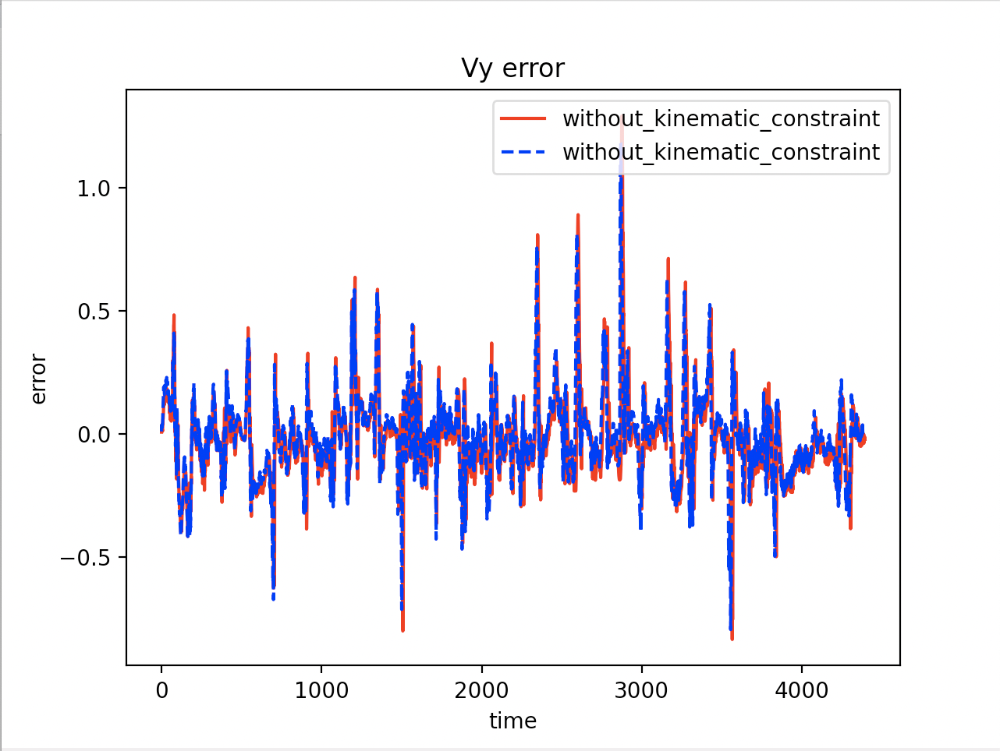
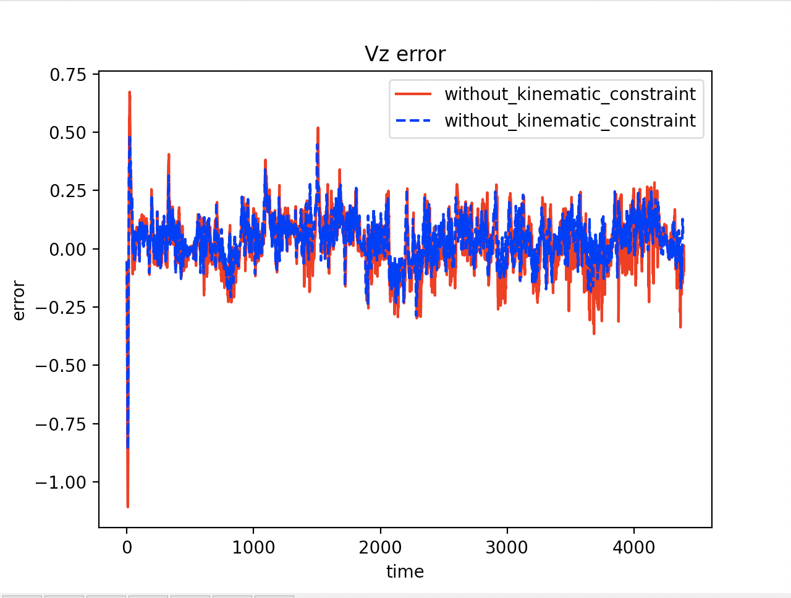
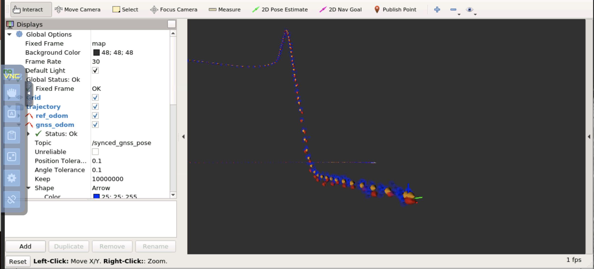
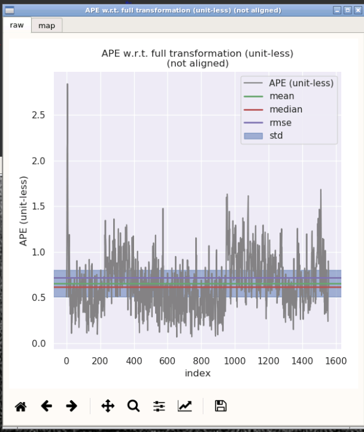
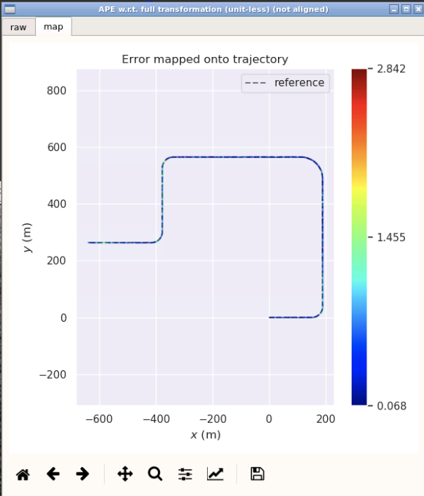
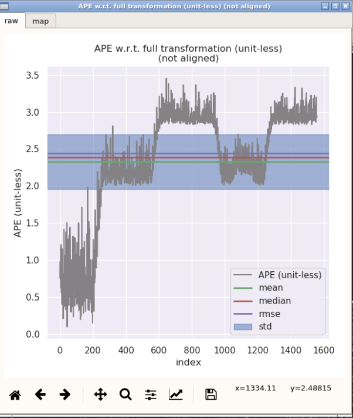
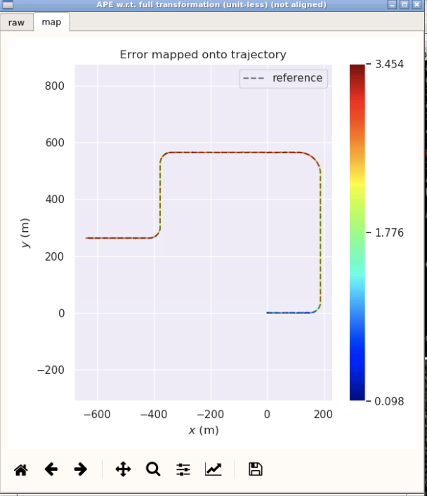

<!--
 * @Author your name
 * @Date 2021-10-16 09:13:34
 * @LastEditTime 2021-10-24 10:48:12
 * @LastEditors Please set LastEditors
 * @Description In User Settings Edit
 * @FilePath /workspace/doc/L8_hw/README.md
-->
# Sensor Fusion for Localization and Mapping Lecture8 Homework

## 1. 实现**融合运动模型**的滤波方法
代码修改部分如下：  
主要是修改观测函数中卡尔曼滤波的更新
``` c++
  // set measurement:
    Eigen::Vector3d dp = pose_.block<3, 1>(0, 3) - T_nb.block<3, 1>(0, 3);
    Eigen::Matrix3d dR = T_nb.block<3, 3>(0, 0).transpose() * pose_.block<3, 3>(0, 0);
    Eigen::Vector3d dtheta = Sophus::SO3d::vee(dR - Eigen::Matrix3d::Identity());
    Eigen::Vector3d dv = pose_.block<3, 3>(0,0).transpose()*vel_ - Eigen::Vector3d::Zero();

    // 测量值
    YPoseVelCons_.block<3, 1>(0, 0) = dp;      // 位置
    YPoseVelCons_.block<3, 1>(3, 0) = dtheta;  // 失准角
    YPoseVelCons_.block<2, 1>(6, 0) = dv.block<2,1>(1,0);      // 速度
    Y = YPoseVelCons_;                         // 构建总的测量

    // set measurement equation:
    GPoseVel_.block<3, 3>(6, kIndexErrorVel) =  pose_.block<3, 3>(0,0).transpose();
    GPoseVel_.block<3, 3>(6, kIndexErrorOri) = Sophus::SO3d::hat(pose_.block<3, 3>(0,0).transpose()*vel_);
    GPoseVelCons_.block<6, kDimState>(0, 0) = GPoseVel_.block<6, kDimState>(0, 0);
    GPoseVelCons_.block<2, kDimState>(6, 0) = GPoseVel_.block<2, kDimState>(7, 0);
    G = GPoseVelCons_;

    CPoseVelCons_.block<6, 6>(0, 0) = Eigen::Matrix<double, 6, 6>::Identity();
    CPoseVelCons_.block<2, 2>(6, 7) = Eigen::Matrix<double, 2, 2>::Identity();

    // 计算卡尔曼增益:
    K = P_ * G.transpose() * (G * P_ * G.transpose() + CPoseVelCons_ * RPoseVel_ * CPoseVelCons_.transpose()).inverse();
```  
此处说明一下，由于PoseVel_相关的变量其构造时的维度和加入运动约束的变量的维度不同，故重新定义了PoseVelCons_相关变量，其维度小了一维。
```c++
Eigen::Matrix<double, kDimMeasurementPoseVel-1, 1> YPoseVelCons_ = Eigen::Matrix<double, kDimMeasurementPoseVelNoise-1, 1>::Zero();
Eigen::Matrix<double, kDimMeasurementPoseVel-1, kDimState> GPoseVelCons_ = Eigen::Matrix<double, kDimMeasurementPoseVel-1, kDimState>::Zero();
Eigen::Matrix<double,kDimMeasurementPoseVel-1, kDimMeasurementPoseVelNoise> CPoseVelCons_ = Eigen::Matrix<double, kDimMeasurementPoseVel-1, kDimMeasurementPoseVelNoise>::Zero();
```  

---  
此外
为了分析添加了运动约束的速度误差，生成速度误差曲线，对KITTIFilteringFlow添加功能，保存速度信息  
速度数据结构  
```c++
    struct {
      size_t N = 0;

      std::deque<double> time_;
      std::deque<Eigen::Vector3f> fused_;
    } velocity_n;
```  
保存数据的函数  
```c++
bool KITTIFilteringFlow::SaveVel(const double& time, const Eigen::Vector3f& vel, std::ofstream& ofs) {
    ofs << time;
    ofs << " ";

    for (int i =0; i<3;++i){
        ofs << vel(i);

        if(i == 2){
            ofs << std::endl;
        } else{
            ofs << " ";
        }
    }
    return true;
}
```
之后在保存轨迹的函数里面以相同方式添加该函数，保存速度

---  
误差结果如下
未加运动约束
```
误差对比如下：  
max     1.248074 
mean    0.262471 
median  0.209593 
min     0.010639 
rmse    0.313390 
sse     313.988113 
std     0.171238    
```
加了运动约束  
```
max      1.135357
mean     0.249666
median   0.187376
min      0.020565
rmse     0.306948
sse      368.672590
std      0.178562
```  
速度误差分析如下  
vy的速度误差曲线
  
vz的速度误差曲线  
  
分析：
1. 从误差数据可以看出，添加了运动约束的误差均值比没有添加运动约束的误差均值要小，这反应了添加了运动约束的情况下，效果较好  
2. 从图示可以看出，添加了运动约束的情况下，对比y方向的速度和z方向的速度，添加了运动约束总体的幅值比没添加运动约束总体的幅值要小，这反应了添加了运动约束的情况下，效果较好  


## 2. 使用GNSS-Sim的仿真数据,实现以gps位置和编码器速度为观测量的融合方法,并分析其精度
主要针对观测方程相应的卡尔曼增益进行修改  
代码修改部分如下：  
```c++
// set measurement:
    Eigen::Vector3d dp = pose_.block<3, 1>(0, 3) - T_nb.block<3, 1>(0, 3);
    Eigen::Matrix3d dR = T_nb.block<3, 3>(0, 0).transpose() * pose_.block<3, 3>(0, 0);
    Eigen::Vector3d dtheta = Sophus::SO3d::vee(dR - Eigen::Matrix3d::Identity());
    Eigen::Vector3d dv = pose_.block<3, 3>(0,0).transpose()*vel_ - v_b;

    // 测量值
    YPosiVel_.block<3, 1>(0, 0) = dp;      // 位置
    YPosiVel_.block<3, 1>(3, 0) = dtheta;  // 失准角
    YPosiVel_.block<3, 1>(6, 0) = dv;      // 速度
    Y = YPosiVel_;                         // 构建总的测量

    // set measurement equation:
    GPosiVel_.block<3, 3>(6, kIndexErrorVel) =  pose_.block<3, 3>(0,0).transpose();
    GPosiVel_.block<3, 3>(6, kIndexErrorOri) = Sophus::SO3d::hat(pose_.block<3, 3>(0, 0).transpose() * vel_);
    G = GPosiVel_;

    CPosiVel_.setZero();
    CPosiVel_.block<3, 3>(0, 0) = Eigen::Matrix3d::Identity();
    CPosiVel_.block<3, 3>(3, 3) = Eigen::Matrix3d::Identity();
    CPosiVel_.block<3, 3>(6, 6) = Eigen::Matrix3d::Identity();

    // 计算卡尔曼增益:
    K = P_ * G.transpose() * (G * P_ * G.transpose() + CPosiVel_ * RPosiVel_ * CPosiVel_.transpose()).inverse();
```  
运行结果如下：  


### fuse的结果如下：
  
  
fuse的误差为  
```
       max      2.452211
      mean      0.639607
    median      0.604427
       min      0.071383
      rmse      0.700523
       sse      763.088418
       std      0.285718
```

### gnss的结果如下
  
  

gnss的误差为  
```
       max      3.453667
      mean      2.327413
    median      2.390021
       min      0.097527
      rmse      2.441472
       sse      9286.900172
       std      0.737516
```  
可以看出，融合了编码器信息的误差明显优于没有融合编码器信息
 
