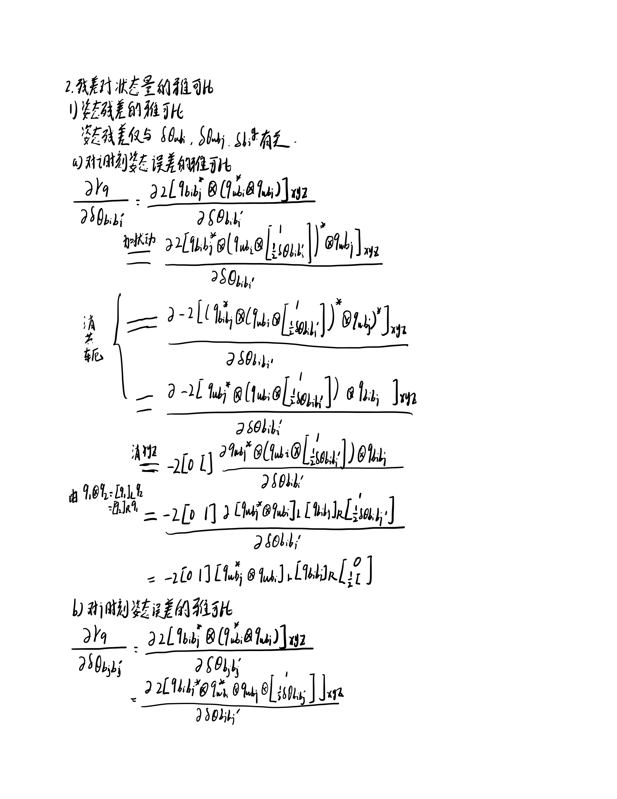
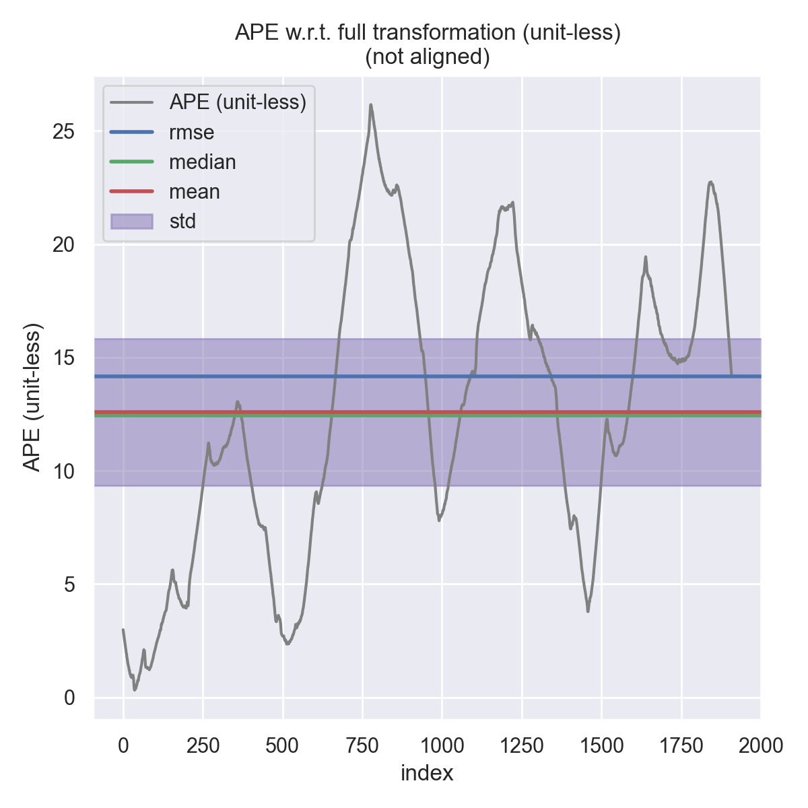
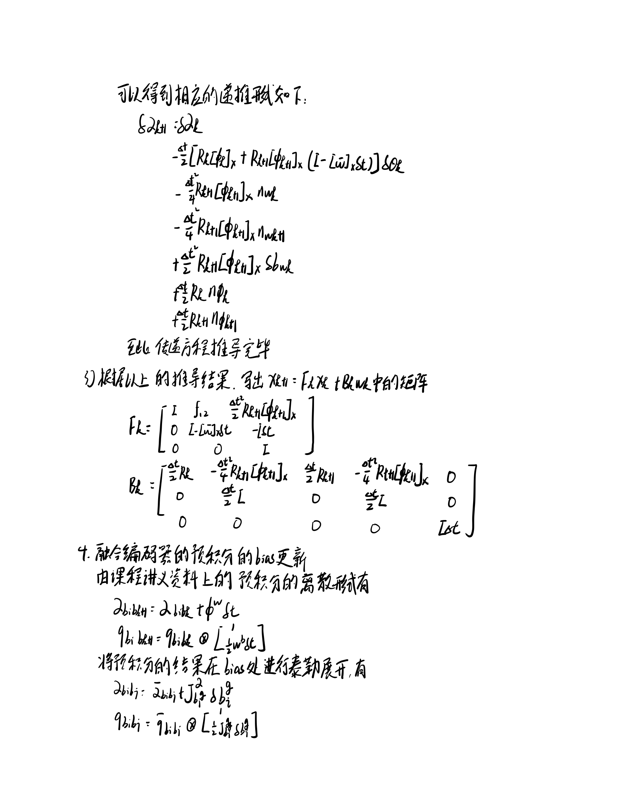

<!--
 * @Author your name
 * @Date 2021-10-24 10:30:41
 * @LastEditTime 2021-10-24 12:01:51
 * @LastEditors Please set LastEditors
 * @Description In User Settings Edit
 * @FilePath /workspace/doc/L9_hw/README.md
-->
# Sensor Fusion for Localization and Mapping Lecture9 Homework

## 1. 实现**基于图优化的建图方法**，补全代码框架  
公式推导如下  
  
  
  
  
  
  

代码修改内容如下  
### a. imu_pre_integrator.cpp
``` c++
//
    // TODO: a. update mean:
    // 
    // 1. get w_mid:
    w_mid = 0.5 * (prev_w + curr_w);        // w_mid
    // 2. update relative orientation, so3:
    prev_theta_ij = state.theta_ij_;                    // q i k
    d_theta_ij = Sophus::SO3d::exp(w_mid * T);          // w_mid^ * t
    state.theta_ij_ = state.theta_ij_ * d_theta_ij;     // q i k+1
    curr_theta_ij = state.theta_ij_;                    // q i k+1
    // 3. get a_mid:
    a_mid = 0.5 * (prev_theta_ij * prev_a + curr_theta_ij * curr_a);   // a_mid 
    // 4. update relative translation:
    state.alpha_ij_ = state.alpha_ij_ + state.beta_ij_ * T + 0.5 * a_mid * T * T;   // \alpha ik+1
    // 5. update relative velocity:         
    state.beta_ij_ = state.beta_ij_ + a_mid * T;                                    // \beta ik+1

    //
    // TODO: b. update covariance:
    // 对应预积分方差计算
    // 1. intermediate results:
    dR_inv = d_theta_ij.inverse().matrix();             // I-w_mid^ * t
    prev_R = prev_theta_ij.matrix();                    // R_k
    curr_R = curr_theta_ij.matrix();                    // R_k+1
    prev_R_a_hat = prev_R * Sophus::SO3d::hat(prev_a);  // R_k(a_k-b_a_k)^
    curr_R_a_hat = curr_R * Sophus::SO3d::hat(curr_a);  // R_{k+1}(a_{k+1}-b_a_{k+1})^

    //
    // TODO: 2. set up F:
    // \delta \dot F
    //
    // F12 & F32:
    F_.block<3, 3>(INDEX_BETA, INDEX_THETA) = -0.50 * (prev_R_a_hat + curr_R_a_hat * dR_inv);       // F32     
    F_.block<3, 3>(INDEX_ALPHA, INDEX_THETA) = 0.50 * T * F_.block<3, 3>(INDEX_BETA, INDEX_THETA);  // F12
    // F14 & F34:
    F_.block<3, 3>(INDEX_BETA,   INDEX_B_A) = -0.50 * (prev_R + curr_R);                            // F34
    F_.block<3, 3>(INDEX_ALPHA,   INDEX_B_A) = 0.50 * T * F_.block<3, 3>(INDEX_BETA,   INDEX_B_A);  // F14
    // F15 & F35:
    F_.block<3, 3>(INDEX_BETA, INDEX_B_G) = 0.50 * T * curr_R_a_hat;                                // F35
    F_.block<3, 3>(INDEX_ALPHA,   INDEX_B_G) = 0.50 * T * F_.block<3, 3>(INDEX_BETA,   INDEX_B_G);  // F15
    // F22:
    F_.block<3, 3>(INDEX_THETA, INDEX_THETA) = -Sophus::SO3d::hat(w_mid);                           // F22

    //
    // TODO: 3. set up G:
    // \delta \dot G
    //
    // G11 & G31:
    B_.block<3, 3>(INDEX_BETA, INDEX_ALPHA) = 0.5 * prev_R;                                         //G31
    B_.block<3, 3>(INDEX_ALPHA, INDEX_ALPHA) = 0.5 * T * B_.block<3, 3>(INDEX_BETA, INDEX_ALPHA);   //G11
    // G12 & G32:
    B_.block<3, 3>(INDEX_BETA, INDEX_THETA) = -0.25 * T * curr_R_a_hat;                             //G32
    B_.block<3, 3>(INDEX_ALPHA, INDEX_THETA) = 0.5 * T * B_.block<3, 3>(INDEX_BETA, INDEX_THETA);   //G31
    // G13 & G33:
    B_.block<3, 3>(INDEX_BETA, INDEX_BETA) = 0.5 * curr_R;                                          //G33
    B_.block<3, 3>(INDEX_ALPHA, INDEX_BETA) = 0.5 * T * B_.block<3, 3>(INDEX_BETA, INDEX_BETA);     //G13
    // G14 & G34:
    B_.block<3, 3>(INDEX_BETA, INDEX_B_A) = -0.25 * T * curr_R_a_hat;                               //G14
    B_.block<3, 3>(INDEX_ALPHA, INDEX_B_A) = 0.5 * T * B_.block<3, 3>(INDEX_BETA, INDEX_B_A);       //G34

    // TODO: 4. update P_:
    // 方差计算
    MatrixF F = MatrixF::Identity() + T * F_;
    MatrixB B = T * B_;
    P_ = F * P_ * F.transpose() + B * Q_ * B.transpose();

    // 
    // TODO: 5. update Jacobian:
    // 预积分bias更新
    //
    J_ = F * J_;
```  
### b. vertex_prvag.hpp
``` c++
    //
    // TODO: do update
    // g2o节点的更新方式
    //
    _estimate.pos += Eigen::Vector3d(
        update[PRVAG::INDEX_POS + 0], update[PRVAG::INDEX_POS + 1], update[PRVAG::INDEX_POS + 2]
    );
    _estimate.ori = _estimate.ori * Sophus::SO3d::exp(
        Eigen::Vector3d(
            update[PRVAG::INDEX_ORI + 0], update[PRVAG::INDEX_ORI + 1], update[PRVAG::INDEX_ORI + 2]
        )
    );
    _estimate.vel += Eigen::Vector3d(
        update[PRVAG::INDEX_VEL + 0], update[PRVAG::INDEX_VEL + 1], update[PRVAG::INDEX_VEL + 2]
    );

    Eigen::Vector3d d_b_a_i(
        update[PRVAG::INDEX_B_A + 0], update[PRVAG::INDEX_B_A + 1], update[PRVAG::INDEX_B_A + 2]
    );
    Eigen::Vector3d d_b_g_i(
        update[PRVAG::INDEX_B_G + 0], update[PRVAG::INDEX_B_G + 1], update[PRVAG::INDEX_B_G + 2]
    );

    _estimate.b_a += d_b_a_i;
    _estimate.b_g += d_b_g_i;

    updateDeltaBiases(d_b_a_i, d_b_g_i);
```  
### c. edge_prvag_imu_pre_integration
``` c++
	//
	// TODO: update pre-integration measurement caused by bias change:
	// bias更新
	// 
	if (v0->isUpdated()) {
        Eigen::Vector3d d_b_a_i, d_b_g_i;
        v0->getDeltaBiases(d_b_a_i, d_b_g_i);
        updateMeasurement(d_b_a_i, d_b_g_i);
    }
	//
	// TODO: compute error:
	// 计算误差，对应预积分计算中的残差设计
	//
	Eigen::Vector3d alpha_ij = _measurement.block<3, 1>(INDEX_P, 0);	// \alpha ij
    Eigen::Vector3d theta_ij = _measurement.block<3, 1>(INDEX_R, 0);	// \theta ij
    Eigen::Vector3d beta_ij = _measurement.block<3, 1>(INDEX_V, 0);		// \beta ij

	// 对应残差
	_error.block<3, 1>(INDEX_P, 0) = ori_i.inverse() * (pos_j - pos_i - (vel_i - 0.5 * g_ * T_) * T_) - alpha_ij;
    _error.block<3, 1>(INDEX_R, 0) = (Sophus::SO3d::exp(theta_ij).inverse() * ori_i.inverse() * ori_j).log();
    _error.block<3, 1>(INDEX_V, 0) = ori_i.inverse() * (vel_j - vel_i + g_ * T_) - beta_ij;
    _error.block<3, 1>(INDEX_A, 0) = b_a_j - b_a_i;
    _error.block<3, 1>(INDEX_G, 0) = b_g_j - b_g_i;
```
## 2. 加入IMU和不加IMU的效果对比和分析
### 加入IMU的结果
  
  
  
```
       max	26.160804
      mean	12.589415
    median	12.425143
       min	0.313007
      rmse	14.160278
       sse	382780.239229
       std	6.482291
```

### 不加入IMU的结果
  
  
  
```
       max	29.320566
      mean	11.780314
    median	11.008160
       min	0.025036
      rmse	13.869264
       sse	367977.976283
       std	7.319884
```

# 3. 融合编码器的预积分推导  
公式推导如下  
  
  
  
  
  
  
