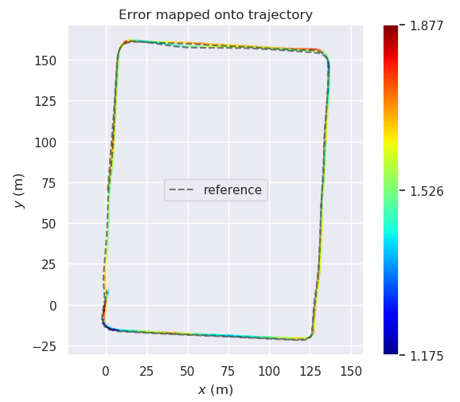

<!--
 * @Description: 
 * @Author: zhiwei chen
 * @Date 2021-11-18 10:01:04
-->

# Sensor Fusion for Localization and Mapping Project Homework

## 1. 修改
由于东京的数据未更新，没有能够使用的外参，只对香港的两个数据进行测试
代码部分主要做了以下几个部分的修改：
### 1.1 话题名称修改
雷达话题：从/kitti/velo/pointcloud, 改为/velodyne_points  
IMU话题：从/kitti/oxts/imu, 改为/imu/data  
GPS话题：从/kitti/oxts/gps/fix, 改为/navsat/fix
速度话题：
### 1.2 数据频率信息的修改
kitti数据集中的，GPS和IMU数据的频率均为10hz，而urbannav中，imu的频率为100hz，GPS的频率为1hz  
所以在gnss_data和imu_data更改数据同步的时间判别  
gnss_data更改为2，imu_data更改为0.02  
### 1.3 外参改变
由于kitti数据集中外参是通过订阅话题得到的，而urbannav中只给了外参参数，在这使用的是直接将外参参数写入到imu_to_lidar矩阵中  
外参信息参考extrinsic.yaml文件中的body_T_LiDAR
其中，HK2019的外参信息为  
```   
2.67949e-08, -1,            0, 0,
1,            2.67949e-08,  0, 0,
0,            0,            1, -0.28, 
0.,           0.,           0., 1    
```  
HK2020的外参信息为  
```
1, 0, 0, 0,
0, 1, 0, 0,
0, 0, 1, 0, 
0, 0, 0, 1
```  
相应的代码内容如下
```c++  
bool DataPretreatFlow::InitCalibration() {
    // lookup imu pose in lidar frame:
    static bool calibration_received = false;
    if (!calibration_received) {
        // TODO no use tf
        //if (lidar_to_imu_ptr_->LookupData(lidar_to_imu_)) {
        //    calibration_received = true;
        //}
        Eigen::Matrix4f imu_to_lidar;
        imu_to_lidar << 2.67949e-08,   -1.0,       0.0,      0.0,
                            1.0,      2.67949e-08,  0.0,      0.0,
                            0.0,         0.0,       1.0,     -0.28,
                            0.0,         0.0,       0.0,      1.0;
        
        lidar_to_imu_ = imu_to_lidar.inverse();
        
        calibration_received = true; 
    }

    return calibration_received;
}
```  
### 1.4 重力常量修改  
根据经纬度以及[Click Here](https://www.sensorsone.com/local-gravity-calculator)网站所提供的g值，修改相应配置文件中的g值为9.78785
### 1.5 速度信息
速度话题, 通过订阅/navsat/odom这个话题获得，具体订阅话题的方式，进行时间同步，检测数据有效性均与速度一致  
通过odom向vel解析的代码如下： 
```c++
    current_velocity_data_.time = current_odom_data_.time;
    current_velocity_data_.linear_velocity.x = current_odom_data_.vel.v.x();
    current_velocity_data_.linear_velocity.y = current_odom_data_.vel.v.y();
    current_velocity_data_.linear_velocity.z = current_odom_data_.vel.v.z();
    current_velocity_data_.angular_velocity.x = current_odom_data_.vel.w.x();
    current_velocity_data_.angular_velocity.y = current_odom_data_.vel.w.y();
    current_velocity_data_.angular_velocity.z = current_odom_data_.vel.w.z();
```
### 1.6 补充细节
滤波器的定位中，需要对执行UpdateLocalization进行如下修改  
```cpp
if ( current_imu_raw_data_.time <= current_cloud_data_.time ) {
        if (HasIMUData() && ValidIMUData() ) {
          UpdateLocalization();
        }
      } else
        {
            break;
        }
```
grapg-optimization中的lio_back_end_node节点同样订阅了/kitti/oxts/gps/vel/extract，需要对速度进行同样的修改

## 2. 建图
### 2.1 实现建图
数据集HK2019的建图结果如下  
    
数据集HK2020的建图结果如下  
    
### 2.3 建图方法的精度分析
数据集HK2019
1. 基于激光里程计+RTK位置的建图精度如下   
laser_odom的评估结果如下：     
```
       max	123.234555
      mean	58.276107
    median	57.910467
       min	0.000001
      rmse	66.460013
       sse	4651030.783461
       std	31.950409
```  
   
   
opimized的评估结果如下：   
```
       max	2.286485
      mean	0.361776
    median	0.294876
       min	0.080310
      rmse	0.437504
       sse	201.554690
       std	0.246025

```  
   
    
数据集HK2020
1. 基于激光里程计+RTK位置的建图精度如下   
laser_odom的评估结果如下：     
```
       max	179.236630
      mean	102.723919
    median	114.227622
       min	0.000002
      rmse	115.090544
       sse	9603229.086261
       std	51.900190
```  
   
   
opimized的评估结果如下：   
```
       max	1.705596
      mean	1.191478
    median	1.202602
       min	0.984498
      rmse	1.198070
       sse	1040.644323
       std	0.125508
```  
   
   
从数据可以看出，优化后的地图精度得到了很大的提高

## 3. 定位
### 3.1 实现**不加融合的定位**
数据集HK2019  
  
数据集HK2020  
  
### 3.2 实现**基于滤波的定位**  
数据集HK2019  
  
数据集HK2020  
  
### 3.3 实现**基于滤波+运动约束的定位**
数据集HK2019  
  
数据集HK2020  
  
### 3.4 实现**基于滑动窗口的定位**
数据集HK2019  
   
数据集HK2020  
   
### 3.5 定位方法精度分析
数据集HK2019  
1. 基于滤波的定位
laser的评估结果如下  
```
       max	3.047673
      mean	0.677733
    median	0.555753
       min	0.087982
      rmse	0.840172
       sse	3002.854796
       std	0.496556
```  
   
   
fused的评估结果如下  
```
       max	3.170057
      mean	0.713178修改
       sse	3202.864802
       std	0.494251

```  
   
   
2. 基于滤波+运动约束的定位  
laser的评估结果如下  
```
       max	3.053128
      mean	0.677518
    median	0.553731
       min	0.088665
      rmse	0.840555
       sse	2998.521407
       std	0.497495
```  
   
   
fused的评估结果如下  
```
       max	3.114505
      mean	0.730918
    median	0.631172
       min	0.008073
      rmse	0.879704
       sse	3284.343558
       std	0.489529
```  
   
   
3. 基于滑动窗口的定位  
laser的评估结果如下  
```
       max	15.004588
      mean	6.177596
    median	7.153256
       min	0.000001
      rmse	7.577662
       sse	266605.520665
       std	4.388424
```  
   
   
optimized的评估结果如下  
```
       max	5.767484
      mean	0.853671
    median	0.523580
       min	0.000001
      rmse	1.327543
       sse	8182.683075
       std	1.016669
```  
   
   
数据集HK2020  
1. 基于滤波的定位
laser的评估结果如下  
```
       max	1.796992
      mean	1.287629
    median	1.299894修改
       std	0.141683
```  
   
   
fused的评估结果如下  
```
       max	1.800288
      mean	1.289338
    median	1.301839
       min	0.993924
      rmse	1.296976
       sse	4370.216707
       std	0.140546
```  
   
   
2. 基于滤波+运动约束的定位  
laser的评估结果如下  
```
       max	1.796992
      mean	1.287629
    median	1.299894
       min	0.996217
      rmse	1.295400
       sse	4359.604650
       std	0.141683
```  
   
   
fused的评估结果如下  
```
       max	2.230343
      mean	1.394269
    median	1.368007
       min	0.952271
      rmse	1.407594
       sse	5147.472661
       std	0.193223
```  
   
   
3. 基于滑动窗口的定位  
laser的评估结果如下  
```
       max	1.877135
      mean	1.575953
    median	1.581819
       min	1.175205
      rmse	1.579264
       sse	6442.195729
       std	0.102214
```  
   
   
optimized的评估结果如下  
```
       max	1.985823
      mean	1.507736
    median	1.512360
       min	0.970237
      rmse	1.523607
       sse	5996.117161
       std	0.219337
```  
   
   
从结果可以看出，基于滑动窗口的定位精度提升明显

## 3. 遗留问题  
由于个人水平原因和时间精力，至今，仍存在一些问题尚未解决，
1. 在建图和定位模块中，初始位姿估计不准  
初步分许感觉是外参不准的原因，理由如下：  
a. 建图模块中，真值轨迹与建图轨迹外形相似，但是存在一个角度偏差，应该是外参差了一个角度。  
b. 定位模块中，初始位姿的估计不准确，这个现象在2020的数据集尤为明显  
   
   
